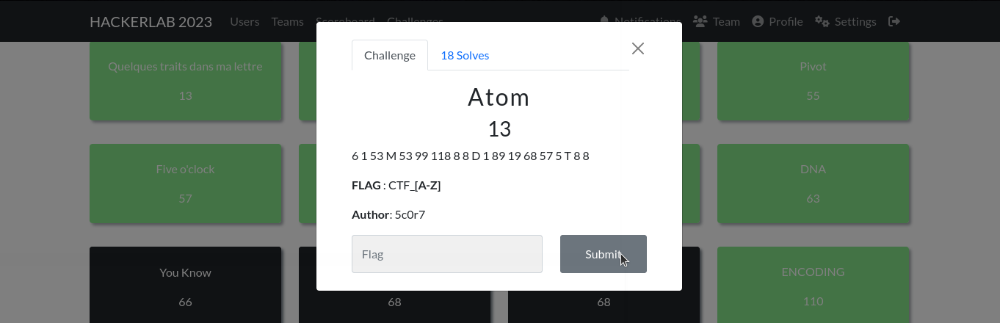
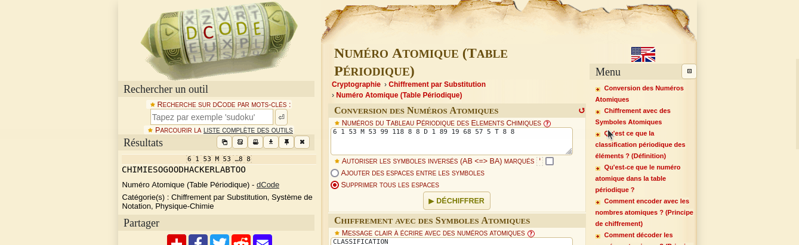

#### Categorie: Cryptography
#### **Author**: 5c0r7
#### Solve: 18/20 
#### Points: 30 pts (at first)|  13 pts (at end)
#### Write-up by: [Gojo](https://twitter.com/GOMEZJohan5) 
#### Description :
6 1 53 M 53 99 118 8 8 D 1 89 19 68 57 5 T 8 8

**FLAG** : CTF_**[A-Z]** 

## Solution :
### Fr Version : 
`For ENG version scroll down` 

Ce châle fait référence aux Atomes, le nom du chall est donc un indice.
L'information donnée en description fait référence au [numéro atomique.](https://www.dcode.fr/substitution-numero-atomique) 
Nous allons sur [Dcode](https://www.dcode.fr/) pour tenter de déchiffrer ce message .

Nous obtenons : CHIMIESOGOODHACKERLABTOO

Flag : `CTF_CHIMIESOGOODHACKERLABTOO` 

------------------------------------------------------------------------

### Eng Version 

This chall refers to Atoms, so the name of the chall is a clue.
The information given in description refers to [atomic numbers.](https://www.dcode.fr/substitution-numero-atomique)
We go to [Dcode](https://www.dcode.fr/) to try to decipher this message

We obtain : CHIMIESOGOODHACKERLABTOO

Flag : `CTF_CHIMIESOGOODHACKERLABTOO` 