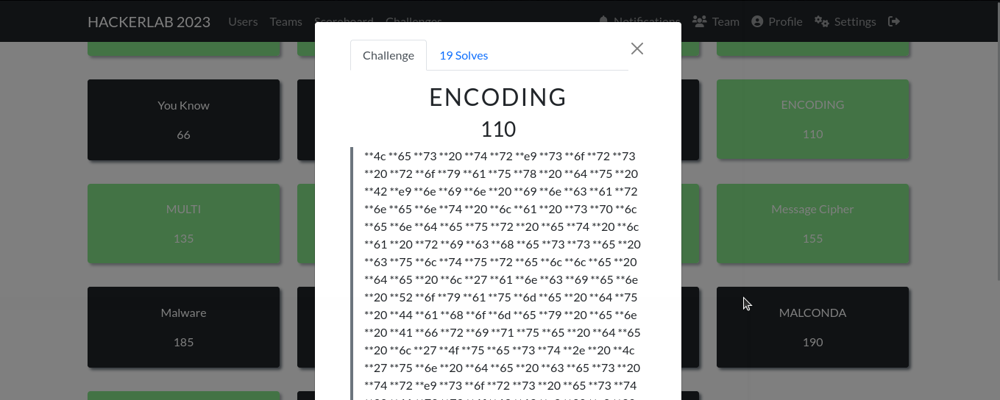
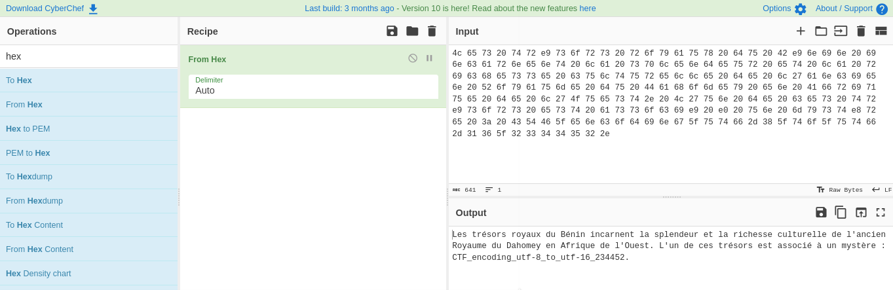

#### Categorie: Steganography 
#### **Author**: unpasswd
#### Solve: 19/20 
#### Points: 200 pts (at first)| 110 pts (at end)

#### Write-up by:[0xJekyll](https://twitter.com/Ted_Kouhouenou) 

### Description : 

`**4c **65 **73 **20 **74 **72 **e9 **73 **6f **72 **73 **20 **72 **6f **79 **61 **75 **78 **20 **64 **75 **20 **42 **e9 **6e **69 **6e **20 **69 **6e **63 **61 **72 **6e **65 **6e **74 **20 **6c **61 **20 **73 **70 **6c **65 **6e **64 **65 **75 **72 **20 **65 **74 **20 **6c **61 **20 **72 **69 **63 **68 **65 **73 **73 **65 **20 **63 **75 **6c **74 **75 **72 **65 **6c **6c **65 **20 **64 **65 **20 **6c **27 **61 **6e **63 **69 **65 **6e **20 **52 **6f **79 **61 **75 **6d **65 **20 **64 **75 **20 **44 **61 **68 **6f **6d **65 **79 **20 **65 **6e **20 **41 **66 **72 **69 **71 **75 **65 **20 **64 **65 **20 **6c **27 **4f **75 **65 **73 **74 **2e **20 **4c **27 **75 **6e **20 **64 **65 **20 **63 **65 **73 **20 **74 **72 **e9 **73 **6f **72 **73 **20 **65 **73 **74 **20 **61 **73 **73 **6f **63 **69 **e9 **20 **e0 **20 **75 **6e **20 **6d **79 **73 **74 **e8 **72 **65 **20 **3a **20 **43 **54 **46 **5f **65 **6e **63 **6f **64 **69 **6e **67 **5f **75 **74 **66 **2d **38 **5f **74 **6f **5f **75 **74 **66 **2d **31 **36 **5f **32 **33 **34 **34 **35 **32 **2e`

## Solution :
### Fr Version :

`For ENG version scroll down` 

Bon à première vue on dirait de l'hexa avec des étoiles (`*`) autour  , on enlève les étoiles qui dérange de manière à avoir un truc plus propre

`4c 65 73 20 74 72 e9 73 6f 72 73 20 72 6f 79 61 75 78 20 64 75 20 42 e9 6e 69 6e 20 69 6e 63 61 72 6e 65 6e 74 20 6c 61 20 73 70 6c 65 6e 64 65 75 72 20 65 74 20 6c 61 20 72 69 63 68 65 73 73 65 20 63 75 6c 74 75 72 65 6c 6c 65 20 64 65 20 6c 27 61 6e 63 69 65 6e 20 52 6f 79 61 75 6d 65 20 64 75 20 44 61 68 6f 6d 65 79 20 65 6e 20 41 66 72 69 71 75 65 20 64 65 20 6c 27 4f 75 65 73 74 2e 20 4c 27 75 6e 20 64 65 20 63 65 73 20 74 72 e9 73 6f 72 73 20 65 73 74 20 61 73 73 6f 63 69 e9 20 e0 20 75 6e 20 6d 79 73 74 e8 72 65 20 3a 20 43 54 46 5f 65 6e 63 6f 64 69 6e 67 5f 75 74 66 2d 38 5f 74 6f 5f 75 74 66 2d 31 36 5f 32 33 34 34 35 32 2e`

Direction [CyberChef](https://gchq.github.io/CyberChef/) on colle le code hexa et on essaie de déchiffrer 
Et nous avons le flag

Flag : `CTF_encoding_utf-8_to_utf-16_234452.`

--------------------------------------------------------------------

### Eng Version

Well at first glance it looks like hexa with stars (`*`) around it, we remove the stars that are disturbing so as to have something cleaner 

`4c 65 73 20 74 72 e9 73 6f 72 73 20 72 6f 79 61 75 78 20 64 75 20 42 e9 6e 69 6e 20 69 6e 63 61 72 6e 65 6e 74 20 6c 61 20 73 70 6c 65 6e 64 65 75 72 20 65 74 20 6c 61 20 72 69 63 68 65 73 73 65 20 63 75 6c 74 75 72 65 6c 6c 65 20 64 65 20 6c 27 61 6e 63 69 65 6e 20 52 6f 79 61 75 6d 65 20 64 75 20 44 61 68 6f 6d 65 79 20 65 6e 20 41 66 72 69 71 75 65 20 64 65 20 6c 27 4f 75 65 73 74 2e 20 4c 27 75 6e 20 64 65 20 63 65 73 20 74 72 e9 73 6f 72 73 20 65 73 74 20 61 73 73 6f 63 69 e9 20 e0 20 75 6e 20 6d 79 73 74 e8 72 65 20 3a 20 43 54 46 5f 65 6e 63 6f 64 69 6e 67 5f 75 74 66 2d 38 5f 74 6f 5f 75 74 66 2d 31 36 5f 32 33 34 34 35 32 2e`

Direction [CyberChef](https://gchq.github.io/CyberChef/) we paste the hexa code and try to decipher
And we have the flag 

Flag : `CTF_encoding_utf-8_to_utf-16_234452.`