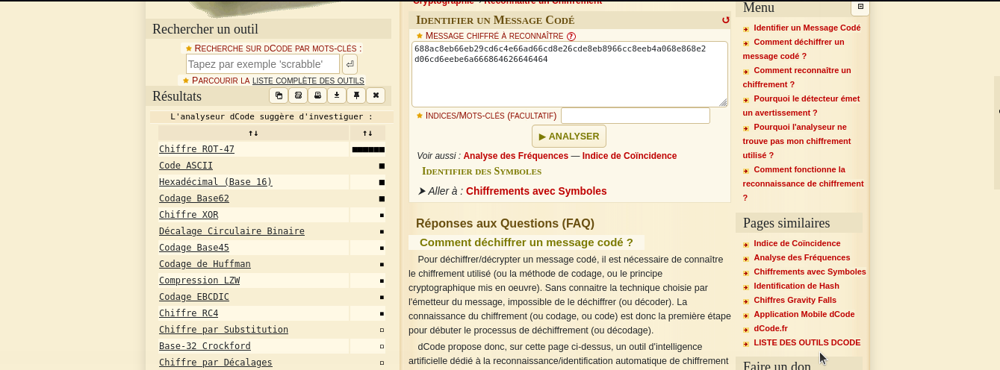

#### Categorie: Cryptography
#### **Author**: r3s0lv3r
#### Solve: 14/20 
#### Points: 70 pts (at first)|  57 pts (at end)

### File : [message\(1\).txt](./Files/message\(1\).txt) 
#### Write-up by: 
#### Description : 
#### **[FR]**
Vous interceptez un message secret du mystérieux groupe Djakpataglo. Il semble que les membres de ce groupe utilisent une technique de cryptage unique basée sur une sorte de déplacement de bits. Trouvez comment récupérer le message transmis pour éviter une catastrophe imminente.
#### **[EN]**
You intercept a secret message from the mysterious Djakpataglo group. It seems that the members of this group are using a unique encryption technique based on a kind of bit shifting. Find out how to retrieve the transmitted message to avoid imminent disaster.

## Solution :
### Fr Version : 

`For ENG version scroll down` 

Nous avons en description un fichier contenant une suite de caractères ressemblant à de l'hexadécimal 
`688ac8eb66eb29cd6c4e66ad66cd8e26cde8eb8966cc8eeb4a068e868e2d06cd6eebe6a666864626646464` 
Comme pour la plupart des autres challenges présentés, nous ne connaissons pas au début le chiffrement, mais grâce à [Dcode](https://www.dcode.fr/) et utilisons l'[identification de chiffrement ](https://www.dcode.fr/identification-chiffrement) utilisé

Nous avons toutes les options possibles avec la chaîne donnée en entier, alors commence une petite fouille pour savoir quel est le bon chiffrement.Nous finissons par tomber sur le 
[Dealage Binaire Circulaire](https://www.dcode.fr/decalage-circulaire-binaire)  qui nous donne un aperçu du flag, voilà donc d'où venait le nom du challenge **Five o'clock** pour faire référence à un chiffrement circulaire.

Pour cette partie, nous avons dû faire par tâtonnement pour déterminer à combien de décalages de bits il a été effectué 

N = 24 et B = 8 (par defaut)

Flag : `CTF_encoding_utf-8_to_utf-16_234452.` 

-------------------------------------------------------------------------
### Eng Version 

NWe have in description a file containing a series of characters resembling hexadecimal
`688ac8eb66eb29cd6c4e66ad66cd8e26cde8eb8966cc8eeb4a068e868e2d06cd6eebe6a666864626646464`
As with most of the other challenges presented we do not know the encryption at the beginning but thanks to [Dcode](https://www.dcode.fr/) and use the [encryption identification](https://www. dcode.fr/identification-cipherment) 

We have all the possible options with the string given in full, so start a little digging to find out which is the right encryption. We end up coming across the
[Dealage Binaire Circulaire](https://www.dcode.fr/decalage-circulaire-binaire) which gives us an overview of the flag, so here is where the name of the challenge **Five o'clock** came from to make reference to circular encryption.

For this part we had to use trial and error to determine how many bit shifts had to be made.

N = 24 and B = 8 (default)
Flag : `CTF_encoding_utf-8_to_utf-16_234452.` 

