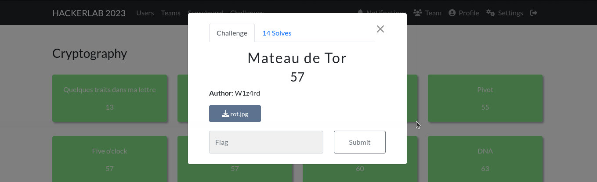
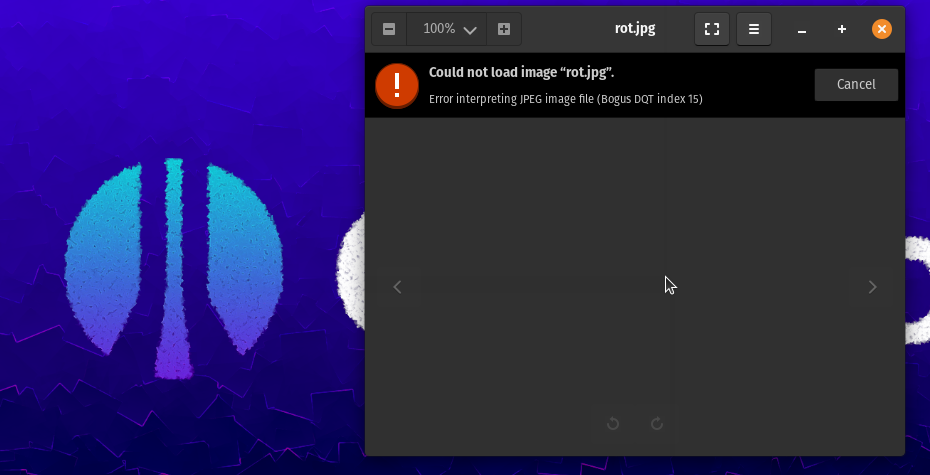
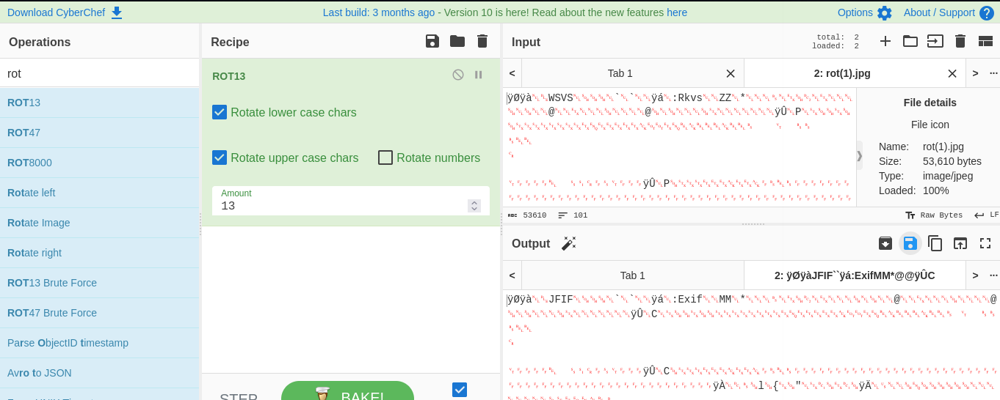
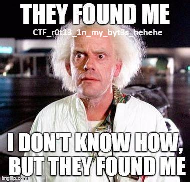

#### Categorie: Cryptography
#### **Author**: W1z4rd
#### Solve: 14/20 
#### Points: 70 pts (at first)|  57 pts (at end)
#### Write-up by: [Jekyll](https://twitter.com/Ted_Kouhouenou/) 
## File : [rot.jpg](Files/rot.jpg)

## Solution :
### Fr Version : 

`For ENG version scroll down` 

Bon d'abord le nom de ce challenge est mal orthographié **Marteau de Tor** je ne suis personne pour faire des corrections je sais.
Nous avons un fichier en description ,tentons de l'ouvrir 

Jamais vu ce genre d'erreur, sauf quand le header semble modifier, verifions le header avec cyberchef

Et par la même occasion, appliquons un Rot sur l'image

Déjà nous pouvons voir que le bon header est affiché `JFIF`  alors nous enregistrons le fichier obtenu et l'ouvrons pour voir

Et wep nous avons le flag 
Belle ref' à retour dans le futur !
### Flag: `CTF_rot13_1n_my_byt3s_hehehe`

--------------------------------------------------------------------------------
### Eng Version 

Well first of all the name of this challenge is misspelled **Marteau de Tor** I'm no one to make corrections I know.
We have a file in description, let's try to open it

Never seen this kind of error, except when the header seems to modify, let's check the header with cyberchef

And at the same time, let's apply a Rot on the image

Already we can see that the correct header is displayed `JFIF` so we save the resulting file and open it to see

And wep we have the flag
Beautiful ref' back in the future!
### Flag: `CTF_rot13_1n_my_byt3s_hehehe`
