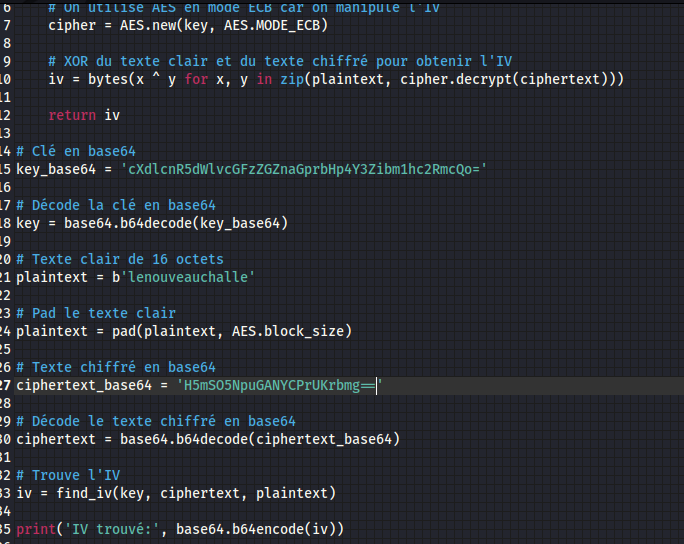

#### Categorie: Cryptography
#### **Author**: 5c0r7
#### Solve: 10/20 
#### Points: 200 pts (at first)|  155 pts (at end)
### File : [script.py](./Files/script.py)
#### Write-up by: [error]()
#### Description : 
#### **[FR]**
Es-tu sûr d'être admin??
#### **[EN]**
Are you sure to be Admin???

**FLAG** : CTF_**[A-Za-z0-9]**
`nc 54.37.70.250 1002`
## Solution :
### Fr Version : 
`For ENG version scroll down` 


Writeup pour le défis cipher message
Au départ du défi nous avons un serveur auquel nous devant nous connecter un script python qui mets en exergue une partie du programme tournant sur le serveur
Voici le contenu du script python :
```python3
from Crypto.Cipher import AES
from Crypto.Util.Padding import pad
from Crypto.Random import get_random_bytes
from base64 import b64decode,b64encode
import sys
FLAG = 'redacted'
def handle():
    print('Welcome rookie! Here I\'m able to encrypt what you want with AES in CBC mode.\nDon\'t try to Enter in Admin room if you aint.\nLet\'s go!!!')
    welcome = """
    Choose what you want to do dude!!!
    [1] Encrypt your message
    [2] Decrypt your message
    [3] Set yout encrypted Key
    [4] Admin Panel
    [5] Exit
    """
    message = ''
    key = ''
    iv = get_random_bytes(16)
    cipher = ''
    while True:
        print(welcome)
        choice = input('$> ')
        if choice not in list('12345'):
            print('Plz redo your choice, seems not undestanble')
        else:
            choice = int(choice)
            if choice == 1:
                t_message = input('Pleazure to encrypt what ever you want. Just tell me :')
                if not len(t_message):
                    print('You enter empty message. Plz try again!!!')
                    message = ''
                else:
                    message = t_message
                    if not len(key):
                        print('You not yet set your key')
                    else:
                        cipher = AES.new(key,AES.MODE_CBC,iv)
                        enc_message = b64encode(cipher.encrypt(pad(message.encode(),AES.block_size)))
                        print('Save your message :',enc_message.decode())
            elif choice == 2:
                if not len(message):
                    print('Message field empty')
                else:
                    print('Oh you already know your message. It\'s :',message)
            elif choice == 3:
                t_key = input('Plz enter your key in base64: ')
                try:
                    t_key = b64decode(t_key)
                    if len(t_key)!=32:
                        print('Invalid Key length(32 need) :',len(t_key))
                        key = ''
                    else:
                        key = t_key
                        print('Save your key')
                except:
                    print('Your base64 key aint valid')
                    key = ''
            elif choice == 4:
                t_iv = input('Enter the iv in base64 to Enter Admin :')
                try:
                    t_t_iv = b64decode(t_iv)
                    if t_t_iv == iv:
                        print('Hi Admin, your flag :', FLAG)
                        break
                except Exception as e:
                    print('Error while decoding your iv, You aint Admin!!!')
            elif choice == 5:
                print('Byeebyebye Rookie')
                break
if __name__ == '__main__':
    handle()
```


Explication du script :

Ce script Python est un petit programme interactif qui offre diverses fonctionnalités liées au chiffrement AES (Advanced Encryption Standard) en mode CBC (Cipher Block Chaining). Lorsqu'un utilisateur exécute le script, il est accueilli avec un message de bienvenue et un menu d'options.
Les principales options du menu sont les suivantes :
1. Chiffrement de message : L'utilisateur peut entrer un message à chiffrer. Si une clé a été définie au préalable, le script utilise AES en mode CBC pour chiffrer le message. Le message chiffré est ensuite affiché en base64.
2. Déchiffrement de message : Si un message a été précédemment chiffré, l'utilisateur peut afficher le message déchiffré.
3. Définition de la clé chiffrée : L'utilisateur peut entrer une clé chiffrée en base64. Le script vérifie si cette clé à la longueur attendue (32 octets) et la sauvegarde pour une utilisation ultérieure.
4. Panneau d'administration : L'utilisateur est invité à entrer un vecteur d'initialisation (IV) en base64. Si cet IV correspond à l'IV précédemment, le script affiche le FLAG secret
Lorsqu’on se connecte sur le serveur on remarque que c’est avec le même processus décrit par le script qu’on interagit


Pour obtenir le secret de FLAG, nous devons trouver l'IV utilisé pour le chiffrement en mode CBC.
Pour ce faire, nous utilisons un script Python externe qui prend la clé en base64, le texte chiffré en base64, et un texte clair spécifique. Voici le contenu de ce script :


```python3
from Crypto.Cipher import AES
from Crypto.Util.Padding import pad, unpad
import base64
def find_iv(key, ciphertext, plaintext):
# On utilise AES en mode ECB car on manipule l'IV
cipher = AES.new(key, AES.MODE_ECB)
# XOR du texte clair et du texte chiffré pour obtenir l'IV
iv = bytes(x ^ y for x, y in zip(plaintext, cipher.decrypt(ciphertext)))
return iv
# Clé en base64
key_base64 = 'cXdlcnR5dWlvcGFzZGZnaGprbHp4Y3Zibm1hc2RmcQo='
# Décode la clé en base64
key = base64.b64decode(key_base64)
# Texte clair de 16 octets
plaintext = b'lenouveauchalle'
# Pad le texte clair
plaintext = pad(plaintext, AES.block_size)
# Texte chiffré en base64
ciphertext_base64 = '511PevXc9CWivxdrqvD9jg=='
# Décode le texte chiffré en base64
ciphertext = base64.b64decode(ciphertext_base64)
# Trouve l'IV
iv = find_iv(key, ciphertext, plaintext)
print('IV trouvé:', base64.b64encode(iv))
```

Explication du script :
Le script commence par définir une fonction appelée **find_iv** . Cette fonction prend une clé, un texte chiffré et un texte clair comme paramètres. Elle utilise la clé pour décrypter le texte chiffré avec **AES**  en mode **ECB** , puis effectue une opération **XOR**  entre le texte clair et le résultat du déchiffrement pour l' `IV`.
Ensuite, le script décode une clé en base64 et décode le texte chiffré en base64 pour obtenir des données binaires. Le texte clair est également défini et rempli pour avoir la taille d'un bloc **AES** .
Enfin, la fonction find_iv est appelée pour calculer l'IV, qui est ensuite encodé en base64 et affiché.


Donc maintenant nous allons copier les informations telles que : la clé en `base64`  , le
message claire et le message chiffré


Puis exécuter le script pour avoir l’ `IV` 

Puis exécuter le script pour avoir l’IV


Flag : `CTF_!_l00v3_cryptO_no_1d0nt`


--------------------------------------------------------------------


### Eng Version 


At the start of the challenge we have a server to which we must connect a python script which highlights part of the program running on the server
Here is the content of the python script:
```python3
from Crypto.Cipher import AES
from Crypto.Util.Padding import pad
from Crypto.Random import get_random_bytes
from base64 import b64decode,b64encode
import sys
FLAG = 'redacted'
def handle():
    print('Welcome rookie! Here I\'m able to encrypt what you want with AES in CBC mode.\nDon\'t try to Enter in Admin room if you aint.\nLet\'s go!!!')
    welcome = """
    Choose what you want to do dude!!!
    [1] Encrypt your message
    [2] Decrypt your message
    [3] Set yout encrypted Key
    [4] Admin Panel
    [5] Exit
    """
    message = ''
    key = ''
    iv = get_random_bytes(16)
    cipher = ''
    while True:
        print(welcome)
        choice = input('$> ')
        if choice not in list('12345'):
            print('Plz redo your choice, seems not undestanble')
        else:
            choice = int(choice)
            if choice == 1:
                t_message = input('Pleazure to encrypt what ever you want. Just tell me :')
                if not len(t_message):
                    print('You enter empty message. Plz try again!!!')
                    message = ''
                else:
                    message = t_message
                    if not len(key):
                        print('You not yet set your key')
                    else:
                        cipher = AES.new(key,AES.MODE_CBC,iv)
                        enc_message = b64encode(cipher.encrypt(pad(message.encode(),AES.block_size)))
                        print('Save your message :',enc_message.decode())
            elif choice == 2:
                if not len(message):
                    print('Message field empty')
                else:
                    print('Oh you already know your message. It\'s :',message)
            elif choice == 3:
                t_key = input('Plz enter your key in base64: ')
                try:
                    t_key = b64decode(t_key)
                    if len(t_key)!=32:
                        print('Invalid Key length(32 need) :',len(t_key))
                        key = ''
                    else:
                        key = t_key
                        print('Save your key')
                except:
                    print('Your base64 key aint valid')
                    key = ''
            elif choice == 4:
                t_iv = input('Enter the iv in base64 to Enter Admin :')
                try:
                    t_t_iv = b64decode(t_iv)
                    if t_t_iv == iv:
                        print('Hi Admin, your flag :', FLAG)
                        break
                except Exception as e:
                    print('Error while decoding your iv, You aint Admin!!!')
            elif choice == 5:
                print('Byeebyebye Rookie')
                break
if __name__ == '__main__':
    handle()
```


Explanation of the script:

This Python script is a small interactive program that offers various features related to AES (Advanced Encryption Standard) encryption in CBC (Cipher Block Chaining) mode. When a user runs the script, they are greeted with a welcome message and a menu of options.
The main menu options are:
1. Message encryption: The user can enter a message to be encrypted. If a key has been defined beforehand, the script uses AES in CBC mode to encrypt the message. The encrypted message is then displayed in base64.
2. Message Decryption: If a message has been previously encrypted, the user can view the decrypted message.
3. Setting the encrypted key: The user can enter a base64 encrypted key. The script checks if this key has the expected length (32 bytes) and saves it for later use.
4. Admin Panel: The user is prompted to enter a base64 initialization vector (IV). If this IV matches the previous IV, the script displays the secret FLAG
When we connect to the server we notice that it is with the same process described by the script that we interact


To get the secret of FLAG, we need to find the IV used for CBC mode encryption.
To do this, we use an external Python script that takes the base64 key, the base64 ciphertext, and a specific plaintext. Here is the content of this script:

```python3
from Crypto.Cipher import AES
from Crypto.Util.Padding import pad, unpad
import base64
def find_iv(key, ciphertext, plaintext):
# On utilise AES en mode ECB car on manipule l'IV
cipher = AES.new(key, AES.MODE_ECB)
# XOR du texte clair et du texte chiffré pour obtenir l'IV
iv = bytes(x ^ y for x, y in zip(plaintext, cipher.decrypt(ciphertext)))
return iv
# Clé en base64
key_base64 = 'cXdlcnR5dWlvcGFzZGZnaGprbHp4Y3Zibm1hc2RmcQo='
# Décode la clé en base64
key = base64.b64decode(key_base64)
# Texte clair de 16 octets
plaintext = b'lenouveauchalle'
# Pad le texte clair
plaintext = pad(plaintext, AES.block_size)
# Texte chiffré en base64
ciphertext_base64 = '511PevXc9CWivxdrqvD9jg=='
# Décode le texte chiffré en base64
ciphertext = base64.b64decode(ciphertext_base64)
# Trouve l'IV
iv = find_iv(key, ciphertext, plaintext)
print('IV trouvé:', base64.b64encode(iv))
```

Explanation of the script:
The script begins by defining a function called **find_iv** . This function takes a key, ciphertext and plaintext as parameters. It uses the key to decrypt the text encrypted with **AES** in **ECB** mode, then performs an **XOR** operation between the plaintext and the decryption result for the `IV`.
Then the script base64 decodes a key and decodes the base64 ciphertext to obtain binary data. The plain text is also set and padded to be the size of an **AES** block.
Finally, the find_iv function is called to calculate the IV, which is then base64 encoded and displayed. 


So now we are going to copy information such as: the `base64` key, the
clear message and encrypted message


Then run the script to get the `IV` 

Then run the script to get the IV


Flag : `CTF_!_l00v3_cryptO_no_1d0nt`

