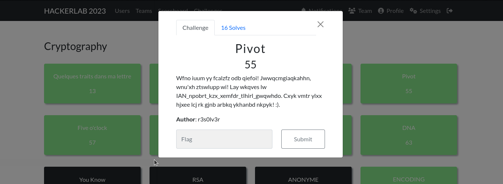

#### Categorie: Cryptography
#### **Author**: r3s0lv3r
#### Solve: 16/20 
#### Points: 70 pts (at first)|  55 pts (at end)
### File : [message.txt](Files/message.txt)
#### Write-up by: [Gojo](https://twitter.com/GOMEZJohan5) 
#### Description : 

Wfno iuum yy fcalzfz odb qiefoi! Jwwqcmgiaqkahhn, wnu'xh ztswlupp wi! Lay wkqves lw IAN_npobrt_kzx_xemfdr_tlhirl_gwqwhdo. Cxyk vmtr ylxx hjxee lcj rk gjnb arbkq ykhanbd nkpyk! :).

## Solution :
### Fr Version : 
`For ENG version scroll down` 



Pour ce chall, nous pouvons voir  dans la description que la  partie *IAN_*  semble correspondre à la partie *CTF* de plus le nom du chall nous donne un indice, il s'agit d'un pivot, la place d'un caractère a été remplacée par un autre. Apres quelque recherche, nous voyons que c'est du Vigenère.
Nous écrivons donc un script, vous faire le travail

```python 3
def dechiffrer_vigenere(message_chiffre, cle):
    message_dechiffre = ""
    cle_repeated = (cle * (len(message_chiffre) // len(cle))) + cle[:len(message_chiffre) % len(cle)]
    for i in range(len(message_chiffre)):
        if message_chiffre[i].isalpha():
            decalage_message = ord(message_chiffre[i].upper()) - ord('A')
            decalage_cle = ord(cle_repeated[i].upper()) - ord('A')
            lettre_dechiffree = chr(((decalage_message - decalage_cle) % 26) + ord('A'))
            if message_chiffre[i].islower():
                lettre_dechiffree = lettre_dechiffree.lower()
            message_dechiffre += lettre_dechiffree
        else:
            message_dechiffre += message_chiffre[i]
    return message_dechiffre

# Exemple d'utilisation
message_chiffre = "Wfno iuum yy fcalzfz odb qiefoi! Jwwqcmgiaqkahhn, wnu'xh ztswlupp wi! Lay wkqves lw IAN_npobrt_kzx_xemfdr_tlhirl_gwqwhdo. Cxyk vmtr ylxx hjxee lcj rk gjnb arbkq ykhanbd nkpyk! :)."
cle = "ABCDEFGHIJKLMNOPQRSTUVWXYZ"
message_dechiffre = dechiffrer_vigenere(message_chiffre, cle)
print("Message déchiffré:\n\n", message_dechiffre)

```


Et nous obtenons ceci 
```bash
Ξ ~/Downloads → python3 vigenere.py 
Message déchiffré:

 Well done on solving the riddle! Congratulations, you've unlocked it! The answer is CTF_decode_the_cipher_riddle_xmfkupz. Keep your wits about you as more brain teasers await! :).

```
---------------------------------------------------------------------

### Eng Version : 


For this chall, we can see in the description that the *IAN_* part seems to correspond to the *CTF* part plus the name of the chall gives us a clue, it is a pivot, the place of a character was replaced by another. After some research, we see that it is Vigenère.
So we write a script, you do the work
```python 3
def dechiffrer_vigenere(message_chiffre, cle):
    message_dechiffre = ""
    cle_repeated = (cle * (len(message_chiffre) // len(cle))) + cle[:len(message_chiffre) % len(cle)]
    for i in range(len(message_chiffre)):
        if message_chiffre[i].isalpha():
            decalage_message = ord(message_chiffre[i].upper()) - ord('A')
            decalage_cle = ord(cle_repeated[i].upper()) - ord('A')
            lettre_dechiffree = chr(((decalage_message - decalage_cle) % 26) + ord('A'))
            if message_chiffre[i].islower():
                lettre_dechiffree = lettre_dechiffree.lower()
            message_dechiffre += lettre_dechiffree
        else:
            message_dechiffre += message_chiffre[i]
    return message_dechiffre

# Exemple d'utilisation
message_chiffre = "Wfno iuum yy fcalzfz odb qiefoi! Jwwqcmgiaqkahhn, wnu'xh ztswlupp wi! Lay wkqves lw IAN_npobrt_kzx_xemfdr_tlhirl_gwqwhdo. Cxyk vmtr ylxx hjxee lcj rk gjnb arbkq ykhanbd nkpyk! :)."
cle = "ABCDEFGHIJKLMNOPQRSTUVWXYZ"
message_dechiffre = dechiffrer_vigenere(message_chiffre, cle)
print("Message déchiffré:\n\n", message_dechiffre)

```


And we get this

```bash
Ξ ~/Downloads → python3 vigenere.py 
Message déchiffré:

 Well done on solving the riddle! Congratulations, you've unlocked it! The answer is CTF_decode_the_cipher_riddle_xmfkupz. Keep your wits about you as more brain teasers await! :).

