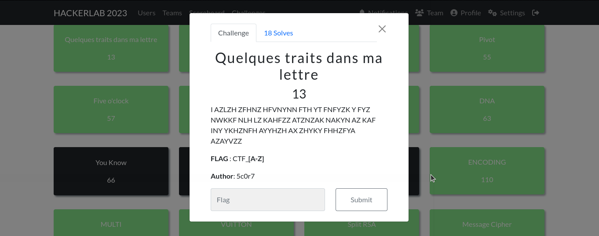
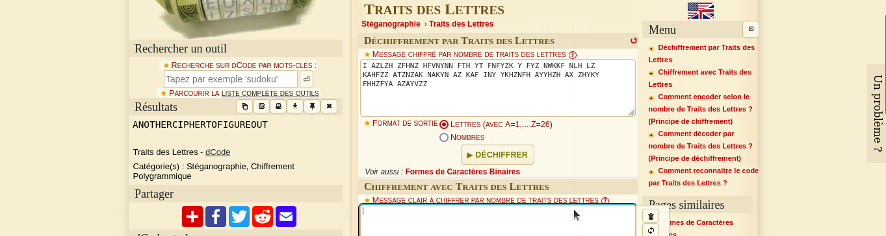

#### Categorie: Cryptography 
#### **Author**: 5c0r7
#### Solve: 18/20 
#### Points: 30 pts (at first)| 13 pts (at end)
#### Write-up by: 

#### Description :

I AZLZH ZFHNZ HFVNYNN FTH YT FNFYZK Y FYZ NWKKF NLH LZ KAHFZZ ATZNZAK NAKYN AZ KAF INY YKHZNFH AYYHZH AX ZHYKY FHHZFYA AZAYVZZ

**FLAG** : CTF_**[A-Z]**

## Fr Version

Le titre de ce challenge a l'air d'un hint vu qu'aucune description n'est donnée avec le challenge.
Après quelques recherches nous tombons sur **Traits des lettres  un moyen de créer un 
Message chiffré par nombre de traits des lettres sur [dcode](https://www.dcode.fr/chiffre-traits-lettre) 

On peut flex on a le flag, on se réfère au format de flag donné
Flag : `CTF_ANOTHERCIPHERTOFIGUREOUT` 

----------------------------------------------------------------------

## En Version

The title of this challenge seems like a hint since no description is given with the challenge.
After some research we came across **Traits of letters a way to create a
Message encrypted by number of strokes of letters on [dcode](https://www.dcode.fr/chiffre-traits-lettre) 

We can flex we have the flag, we refer to the given flag format 
Flag : `CTF_ANOTHERCIPHERTOFIGUREOUT` 

