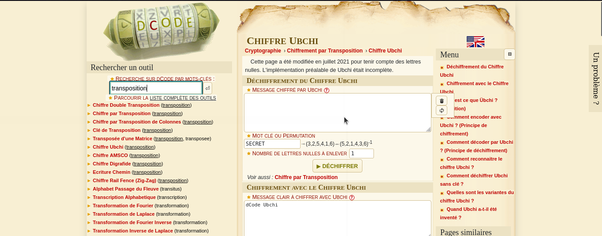
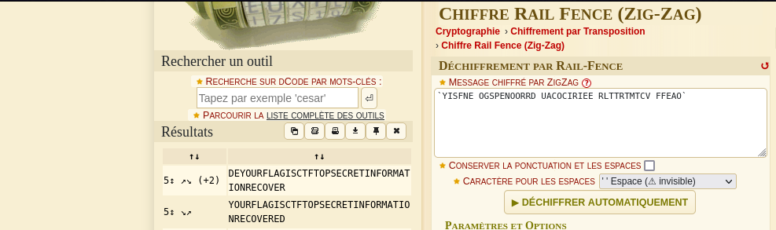

#### Categorie: Cryptography 
#### **Author**: r3s0lv3r
#### **FLAG** : CTF_**password** 

#### Solve: 14/20 
#### Points: 30 pts (at first)|  17 pts (at end)

### File: [Transpose.txt](Files/Transpose.txt)
#### Write-up by:  [OxJekyll](https://twitter.com/Ted_Kouhouenou)

## Solution :
### Fr Version : 

`For ENG version scroll down` 

Le contenu du fichier est le suivant : 

`YISFNE OGSPENOORRD UACOCIRIEE RLTTRTMTCV FFEAO` 

Le nom du challenge doit surement etre un indice tentons voir avec [dcode](https://www.dcode.fr/) 
et essayons de rechercher le terme *Transposition* 
Nous obtenons une liste contenants tout les chiffrements par transposition ,et tentons chacun d'eux

FInalement le chiffrement qui etait le bon etait le ` Rail Fence (Zig-Zag)` 

### Flag :  `CTF_TOPSECRETINFORMATIONRECOVERED`
