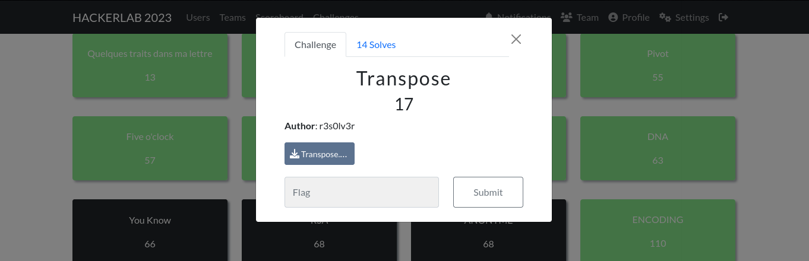

#### Categorie: Cryptography 
#### **Author**: r3s0lv3r
#### **FLAG** : CTF_**password** 

#### Solve: 14/20 
#### Points: 30 pts (at first)|  17 pts (at end)

### File: [Transpose.txt](Files/Transpose.txt)
#### Write-up by:  [OxJekyll](https://twitter.com/Ted_Kouhouenou)

## Solution :
### Fr Version : 

`For ENG version scroll down` 

