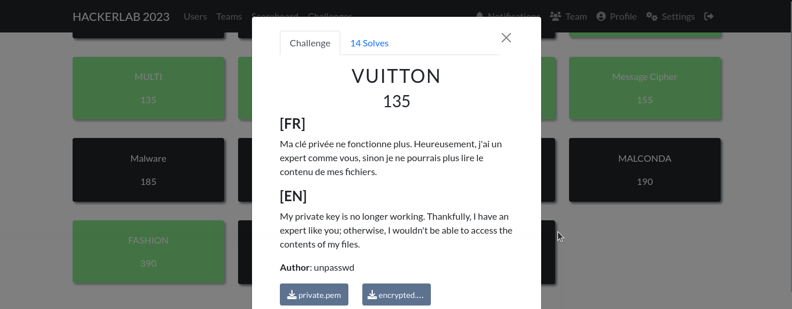

#### Categorie: Crypto 
#### **Author**: unpasswd
#### Solve: 14/20 
#### Points: 200 pts (at first)| 130 pts (at end)

#### Write-up by: Jekyll ([0xJekyll](https://twitter.com/Ted_Kouhouenou))
### Files :  [private.pem](./Files/private.pem) ,  [encrypted.txt](./Cryptography/Files/encrypted.txt) 
#### Description :
#### **[FR]**

Ma clé privée ne fonctionne plus. Heureusement, j'ai un expert comme vous, sinon je ne pourrais plus lire le contenu de mes fichiers.
#### **[EN]**

My private key is no longer working. Thankfully, I have an expert like you; otherwise, I wouldn't be able to access the contents of my files.


## Solution :
### Fr Version : 

`For ENG version scroll down` 




### Information 
Nous avons deux fichiers a notre disposition [private.pem](https://github.com/Tednoob17/Final-HackerLab2023/tree/main/Cryptography/Files/private.pem)  et [encrypted.txt](https://github.com/Tednoob17/Final-HackerLab2023/tree/main/Cryptography/Files/encrypted.txt) 


Cela ressemble a un challenge classique , le flag a été chiffré grâce à la clé privée RSA se trouvant dans  le fichier "privkey.pem".
Tentons d'utiliser openssl pour voir ce qu'on aura comme resultat 

> Commande

```bash 
openssl rsautl -decrypt -inkey private.pem -in encrypted.txt -out result
```

> Sortie


Nous avons  une erreur , et elle concerne le fichier `private.pem`
Essayons de voir ce que contiennent les fichiers.


- **private.pem**


Les deux croix rouges ne sont pas normal , je decide de les remplacer par des vraies caracteres `x` et d'enregistrer le fichier. 

- **encrypted.txt**
	


On peut  réessayer pour déchiffrer le flag :


Et Flagggggggggggggggggg!

Flag: `CTF_repair_rsa_file_openssl_32145`

------------------------------------------------------------------

- ### EN Version


### Information 
We have two files available [private.pem](https://github.com/Tednoob17/Final-HackerLab2023/tree/main/Cryptography/Files/private.pem)  et [encrypted.txt](https://github.com/Tednoob17/Final-HackerLab2023/tree/main/Cryptography/Files/encrypted.txt) 


This looks like a classic challenge: the flag has been encrypted using the RSA private key in the "privkey.pem" file.
Let's try using openssl to see what the result will be

> Command

```bash 
openssl rsautl -decrypt -inkey private.pem -in encrypted.txt -out result
```

> Output 


We have an error, and it concerns the `private.pem` file.
Let's see what these files contain.


- **private.pem**


The two red crosses are not normal, I decide to replace them with real `x` characters and save the file. 

- **encrypted.txt**
	


We can try again to decrypt the flag:


And Flagggggggggggggggggg!

Flag: `CTF_repair_rsa_file_openssl_32145`
