#### Categorie: Forensic 
#### **Author**: W1z4rd
#### Solve: 17/20 
#### Points: 70 pts (at first)| 60 pts (at end)
### Files: [HLB_Forensic.evtx](./Forensic/Files/HLB_Forensic.evtx)  

#### Write-up by: Amoweak ([Amoweak](https://))
#### Description :
**[FR]** 
Cyberattaque du groupe DɔkunXɔsu sur la réserve nationale de trésors royaux du Bénin. Les analystes IR ont réussi à récupérer les logs des événements Windows.

**[EN]** 
Cyberattack by the DɔkunXɔsu group on Benin's national reserve of royal treasures. IR analysts were able to recover Windows event logs.

- ### Write-Ups
  ### FR Version 
  
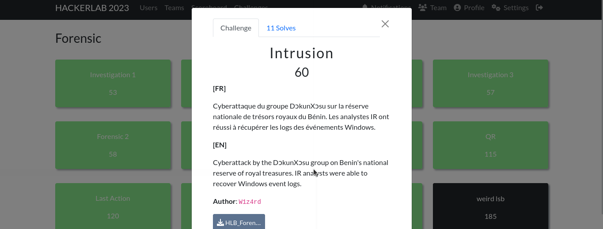

Après téléchargement du fichier, on note l’extension « .evtx », utilisée pour les journaux d’événements et un outil pouvant l’ouvrir il y a un : l’Observateur d’événements de Windows. On essaie donc de l’ouvrir avec et voici le résultat :

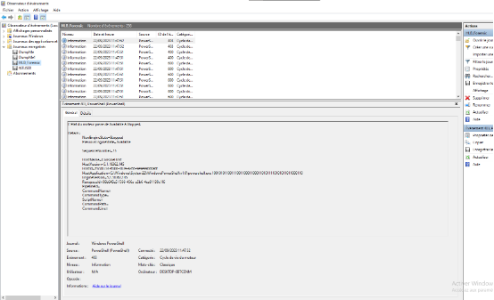

Première chose on essaie de rechercher le mot clé « CTF » mais comme lors de cet CTF, on tombe sur des **faux flags** on ne peut pas savoir à quoi s'attendre 😒

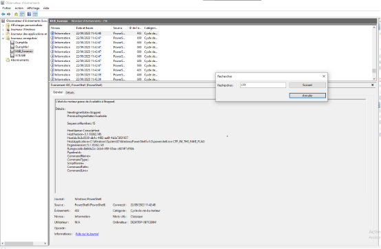

On fouille ensuite les différentes lignes du fichier, et on tombe sur deux lignes intrigantes :
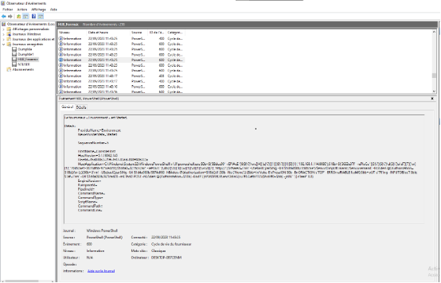

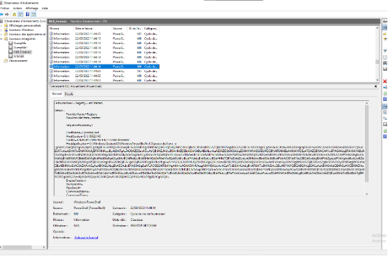

C’est la seconde image qu’on avait trouvée pendant nos fouilles  d’où le fait qu’on ne se soit plus concentré dessus.

J’essaie de décoder le message en se basant sur le fait qu’il a été codé en base 64, sur CyberChef. On obtient du texte assez descriptif qu’il s’agit d’une commande PowerShell.

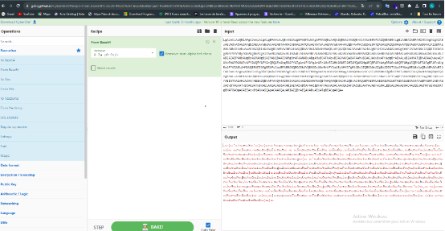

On télécharge le fichier pour par la suite le faire analyser pour essayer de comprendre le code. Mais par surprise, quand on ouvre le fichier téléchargé, on arrive à lire la commande facilement.

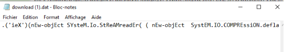

On essaie d’exécuter la commande, mais on reçoit ceci :

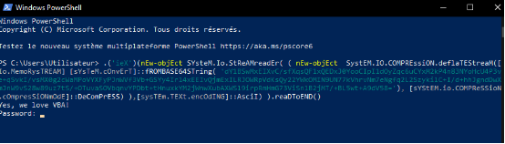
Bloqué sur le mot de passe, on demande en indice Mrs. W1z4rd (le radin  🤣 en Hint), il donne quand même l’indice que le code PowerShell est obffusquer. Donc on cherche un outil permettant de désobfusquer du code PowerShell. Après des recherches longues, on tombe sur cet outil :

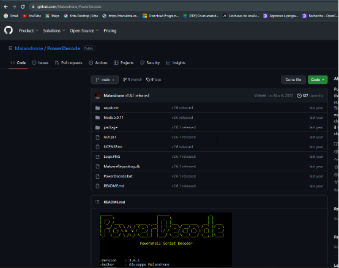
> Source : `https://github.com/Malandrone/PowerDecode` 

On essaie d’exécuter cet outil, en suivant les différentes étapes pour l’automatisation de la tâche à effectuer :

on exécute avec PowerShell, le fichier « GUI.ps1 » et ceci s’affiche :
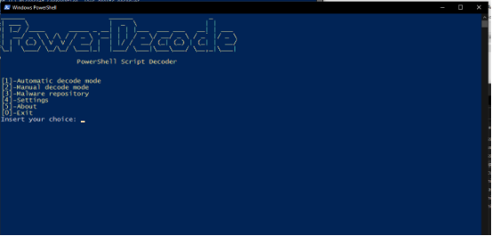
En cliquant sur 1 et enfin sur 1 pour décoder un seul fichier et finalement on choisit le fichier à analyser, qui est le fichier téléchargé depuis CyberChef.

Après plusieurs tentatives, il a fallu enlever cette partie pour recevoir un bon résultat : « . (‘ieX’) ».

Et donc on a le flag ici qui s’affiche :

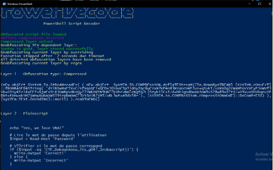
Flag: `CTF_DokounXosu_its_g047_1nvbascript))` 

-----------------------------------------------------------
 
  ### EN Version 
  
  

After downloading the file, we note the ".evtx" extension, used for event logs, and a tool that can open it: Windows Event Viewer. So we try to open it with this tool, and here's the result:

First of all, we try to search for the keyword "CTF", but since this CTF comes up with **false flags**, we don't know what to expect 😒

We then search the various lines of the file, and come across two intriguing lines:

It's the second image we'd found during our search, which is why we stopped concentrating on it.

I try to decode the message based on the fact that it has been encoded in base 64, on CyberChef. We get some fairly descriptive text that it's a PowerShell command.

We download the file and then have it analyzed to try and understand the code. Surprisingly, when you open the downloaded file, you can easily read the command.

We try to execute the command, but we receive this:

Stuck on the password, we ask for a hint Mr. W1z4rd (the stingy 🤣 in Hint), 
he still gives the hint that the PowerShell code is obfuscated. So we're looking for a tool to unobfuscate PowerShell code. After a lengthy search, we came across this tool:

> Source : `https://github.com/Malandrone/PowerDecode` 

We try to run this tool, following the various steps for automating the task in hand:

Execute the "GUI.ps1" file in PowerShell, and you'll see :

Clicking on 1 and then on 1 to decode a single file, and finally selecting the file to be analyzed, which is the file downloaded from CyberChef.

After several attempts, we had to remove this part to get a good result: "('ieX')".

And so we have the flag displayed here:

Flag: `CTF_DokounXosu_its_g047_1nvbascript))` 
