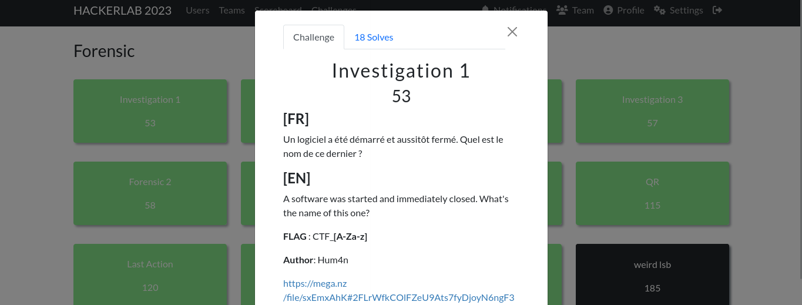
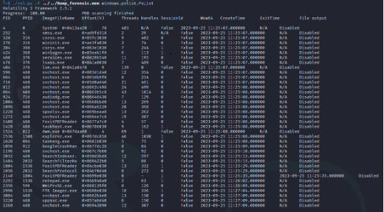

#### Categorie: Forensic 
#### **Author**: Hum4n
#### Solve: 17/20 
#### Points: 70 pts (at first)| 53 pts (at end)
#### Files: [Dum_forensic.mem]([https://mega.nz/file/sxEmxAhK#2FLrWfkCOlFZeU9Ats7fyDjoyN6ngF3wjAD4HsbSheU](https://mega.nz/file/sxEmxAhK#2FLrWfkCOlFZeU9Ats7fyDjoyN6ngF3wjAD4HsbSheU))   (1GB)
#### Write-up by: Amoweak ([Amoweak](https://))
### Flag Format : CTF_**[A-Za-z]** 
#### Description :
#### **[FR]**
Un logiciel a été démarré et aussitôt fermé. Quel est le nom de ce dernier ?
#### **[EN]**
A software was started and immediately closed. What's the name of this one?


- ### Write-Ups
  ### FR Version
  


Déjà avec le **« .mem »**  sans même vérifier le type du fichier, on a pensé à un dump de la mémoire d’une machine à un instant donné. On a pensé à utiliser **« volatility»**    pour pouvoir examiner la mémoire.

> Info 
> Volatility est un framework open source pour l'informatique légale et en particulier le recouvrement de mémoire, utilisé dans la réponse à incident informatique et l'analyse des logiciels malveillants. Le logiciel est écrit en Python et prend en charge les systèmes d'exploitation Microsoft Windows, Mac OS X et Linux.


> Source Volatility: `https://github.com/volatilityfoundation/volatility` 
> Site Web : `https://github.com/volatilityfoundation/volatility` 
> CheatSheet : `https://github.com/Tednoob17/h4cker/blob/master/cheat_sheets/volatility-memory-forensics-cheat-sheet.pdf` 

Et donc on a listé la liste des processus récupérables avec l’outil :

```bash
./vol.py -f ../../Dump_forensic.mem windows.golist.PsList
```


Sans grande difficulté, on remarque toute de suite de quel processus il s’agit avec les mots clés « **ExitTime » et « CreateTime »** .

Donc le flag est : CTF_FoxitPDFReader.

Flag: `CTF_FoxitPDFReader` 


###  EN Version 

  


Already with the **“.mem”** without even checking the file type, we thought of a dump of the memory of a machine at a given moment. We thought about using **“volatility”** to be able to examine memory. 

> Info
> Info
> Volatility is an open source framework for computer forensics and in particular memory recovery, used in computer incident response and malware analysis. The software is written in Python and supports Microsoft Windows, Mac OS X and Linux operating systems.

> Source Volatility: `https://github.com/volatilityfoundation/volatility` 
> Site Web : `https://github.com/volatilityfoundation/volatility` 
> CheatSheet : `https://github.com/Tednoob17/h4cker/blob/master/cheat_sheets/volatility-memory-forensics-cheat-sheet.pdf` 

And so we have listed the list of processes recoverable with the tool:

```bash
./vol.py -f ../../Dump_forensic.mem windows.golist.PsList
```


Without much difficulty, we immediately notice which process it is with the keywords “**ExitTime” and “CreateTime”**.

So the flag is: CTF_FoxitPDFReader.

Flag: `CTF_FoxitPDFReader` 
