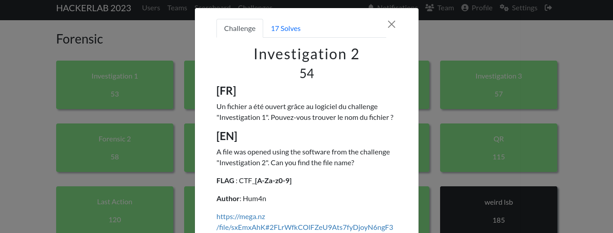
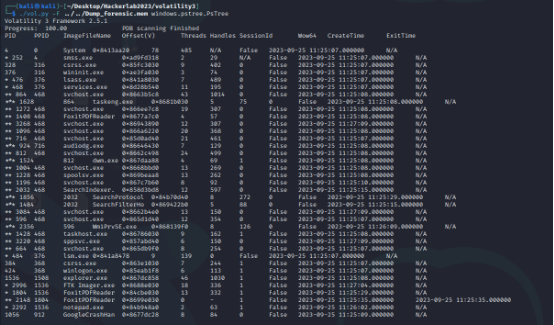

#### Categorie: Forensic 
#### **Author**: Hum4n
#### Solve: 17/20 
#### Points: 70 pts (at first)| 54 pts (at end)
#### Files: [Dump_forensic.mem]([https://mega.nz/file/sxEmxAhK#2FLrWfkCOlFZeU9Ats7fyDjoyN6ngF3wjAD4HsbSheU](https://mega.nz/file/sxEmxAhK#2FLrWfkCOlFZeU9Ats7fyDjoyN6ngF3wjAD4HsbSheU))    (1GB)
#### Write-up by: Amoweak ([Amoweak](https://tweeter/sinaamand05))  

### Flag Format : CTF_**[A-Za-z]**  
#### **[FR]**
Un fichier a été ouvert grâce au logiciel du challenge "Investigation 1". Pouvez-vous trouver le nom du fichier ?
#### **[EN]**
A file was opened using the software from the challenge "Investigation 2". Can you find the file name?


- ### Write-Ups
  ### FR Version
  
Première chose, on a pensé à faire une arborescence de l’ensemble des processus.

Grâce au site **« [HackTricks](https://book.hacktricks.xyz/welcome/readme) »**  , et spécialement de la branche réservée à l’utilisation de l’outil  **« [volatility](https://book.hacktricks.xyz/generic-methodologies-and-resources/basic-forensic-methodology/memory-dump-analysis/volatility-cheatsheet) »** , on a lancé cette commande :

```bash
./vol.py -f ../../Dump_forensic.mem windows.pstree.PsTree
```


Mais cela n’a rien donné de bon…

Ainsi, on a pensé à chercher plus loin. On est tombé sur le plugin **« Windows.cmdline.CmdLine »** , qui permet de vérifier si un plugin a été exécuté de manière malveillante ou non. Ainsi on s’est dit que si un fichier est lancé par un programme, on pourrait l’identifier dans cette liste. On a ensuite essayé le plugin qui nous a donné ce résultat.

```bash
./vol.py -f ../../Dump_forensic.mem Windows.cmdline.CmdLine
```


En regardant la liste, on identifie le programme ** « FoxitPDFReader » **,  on voit un certain fichier PDF exécuté avec ce programme, au niveau du PID `1804' 

On a essayé d’entrer : **CTF_un-zeste-de-python.PDF**  mais cela n’a pas pris, ce qui était étrange. On a donc enlevé le « .PDF », et c’est finalement passé.

Donc le flag recherché est donc : CTF_un-zeste-de-python.

Flag: `CTF_un-zeste-de-python` 


-----------------------------------------------------------------


### EN Version


  
First thing, we thought about making a tree structure of all the processes.

Thanks to the site **“[HackTricks](https://book.hacktricks.xyz/welcome/readme)”**, and especially the branch reserved for the use of the tool **“[volatility](https ://book.hacktricks.xyz/generic-methodologies-and-resources/basic-forensic-methodology/memory-dump-analysis/volatility-cheatsheet) »**, we ran this command:

```bash
./vol.py -f ../../Dump_forensic.mem windows.pstree.PsTree
```


But it didn't do anything good...

So, we thought to look further. We came across the plugin **“Windows.cmdline.CmdLine”**, which allows you to check whether a plugin has been executed maliciously or not. So we said to ourselves that if a file is launched by a program, we could identify it in this list. We then tried the plugin which gave us this result.

```bash
./vol.py -f ../../Dump_forensic.mem Windows.cmdline.CmdLine
```


Looking at the list, we identify the program **“FoxitPDFReader”**, we see a certain PDF file executed with this program, at PID `1804`

We tried to enter: **CTF_un-zeste-de-python.pdf** but it didn't take, which was strange. So we removed the “.pdf”, and it finally worked.

So the flag sought is: CTF_un-zeste-de-python.

Flag: `CTF_un-zeste-de-python` 