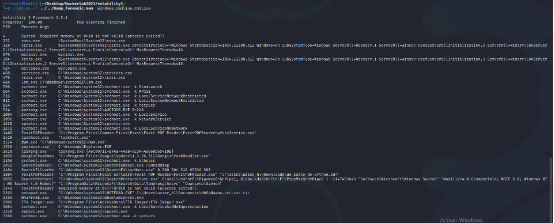

#### Categorie: Forensic 
#### **Author**: Hum4n
#### Solve: 17/20 
#### Points: 70 pts (at first)| 54 pts (at end)
#### Files: [Dump_forensic.mem]([https://mega.nz/file/sxEmxAhK#2FLrWfkCOlFZeU9Ats7fyDjoyN6ngF3wjAD4HsbSheU](https://mega.nz/file/sxEmxAhK#2FLrWfkCOlFZeU9Ats7fyDjoyN6ngF3wjAD4HsbSheU))    (1GB)
#### Write-up by: Amoweak ([Amoweak](https://)) 

### Flag Format : CTF_**[A-Za-z]**  
#### **[FR]**
Un fichier a été ouvert grâce au logiciel du challenge "Investigation 1". Pouvez-vous trouver le nom du fichier ?
#### **[EN]**
A file was opened using the software from the challenge "Investigation 2". Can you find the file name?


- ### Write-Ups
  ### FR Version
  
Première chose, on a pensé à faire une arborescence de l’ensemble des processus.

Grâce au site **« [HackTricks](https://book.hacktricks.xyz/welcome/readme) »**  , et spécialement de la branche réservée à l’utilisation de l’outil  **« [volatility](https://book.hacktricks.xyz/generic-methodologies-and-resources/basic-forensic-methodology/memory-dump-analysis/volatility-cheatsheet) »** , on a lancé cette commande :

```bash
./vol.py -f ../../Dump_forensic.mem windows.pstree.PsTree
```


Mais cela n’a rien donné de bon…

Ainsi, on a pensé à chercher plus loin. On est tombé sur le plugin **« Windows.cmdline.CmdLine »** , qui permet de vérifier si un plugin a été exécuté de manière malveillante ou non. Ainsi on s’est dit que si un fichier est lancé par un programme, on pourrait l’identifier dans cette liste. On a ensuite essayé le plugin qui nous a donné ce résultat.

```bash
./vol.py -f ../../Dump_forensic.mem Windows.cmdline.CmdLine
```


