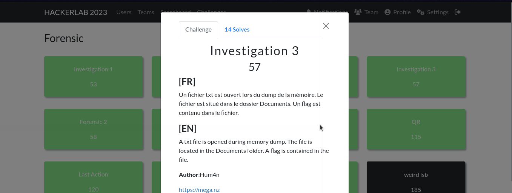
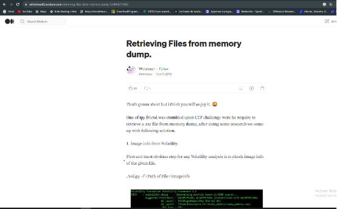
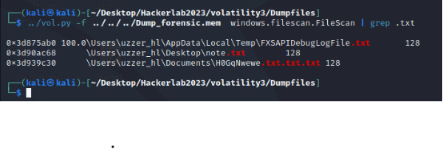
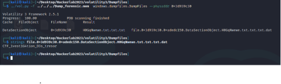

#### Categorie: Forensic 
#### **Author**: Hum4n
#### Solve: 14/20 
#### Points: 70 pts (at first)| 57 pts (at end)
#### Files: [Dump_forensic.mem]([https://mega.nz/file/sxEmxAhK#2FLrWfkCOlFZeU9Ats7fyDjoyN6ngF3wjAD4HsbSheU](https://mega.nz/file/sxEmxAhK#2FLrWfkCOlFZeU9Ats7fyDjoyN6ngF3wjAD4HsbSheU))   (1GB)
#### Write-up by: Amoweak ([Amoweak](https://tweeter/sinaamand05)) 

### Flag Format : CTF_**[A-Za-z]**  

#### **[FR]**

Un fichier txt est ouvert lors du dump de la mémoire. Le fichier est situé dans le dossier Documents. Un flag est contenu dans le fichier.
#### **[EN]**
A txt file is opened during memory dump. The file is located in the Documents folder. A flag is contained in the file.

### Write-up
#### FR Version

Des recherches ont d’abord été faites pour pouvoir faire la tâche.
`see all files open volatility`

On a suivi le second lien, l’article medium. Grâce à cet article, on a pu effectuer la tâche demandée.

En suivant, l’article, on a essayé de trouver les documents ouverts dans le dump, en particulier les fichiers txt dans notre cas.

Notre document ici est le troisième document de la liste. On essaie ensuite de récupérer le fichier en nous basant sur l’adresse physique affichée ici pour ce fichier, avec le plugin : **« Windows.dumpfiles.DumpFiles ».** 

On note un fichier récupéré. En essayant d’afficher les chaînes de caractère présent sur le fichier, par la suite, voici le résultat :

Le flag est donc : CTF_1vest1G4tion_D3s_tresor .

Flag: `CTF_1vest1G4tion_D3s_tresor`

-----------------------------------------------------------------
#### EN Version

Research was first carried out to be able to accomplish this task.
`see all files open volatility`

We followed the second link, the medium article. Thanks to this article, we were able to complete the requested task.

Following the article, we tried to find open documents in the dump, in particular txt files in our case.

Our document here is the third document in the list. We then try to recover the file based on the physical address displayed here for this file, with the plugin: **"Windows.dumpfiles.DumpFiles"**. 

A recovered file is noted. Trying to display the strings present in the file afterwards, here's the result :

The flag is : CTF_1vest1G4tion_D3s_tresor .

Flag: `CTF_1vest1G4tion_D3s_tresor`
