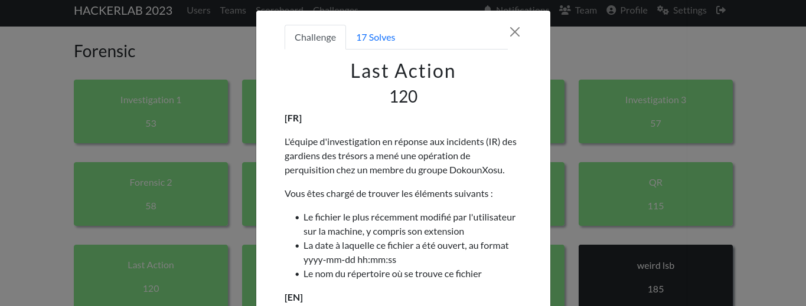
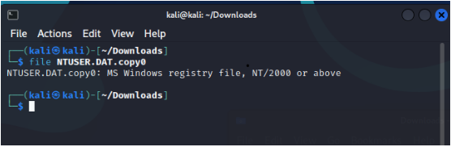
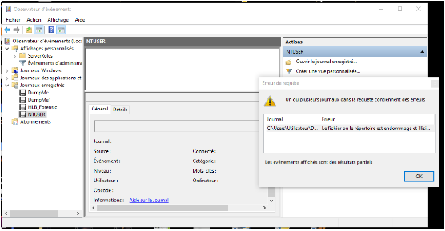
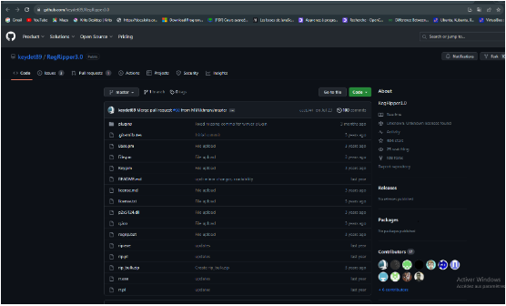
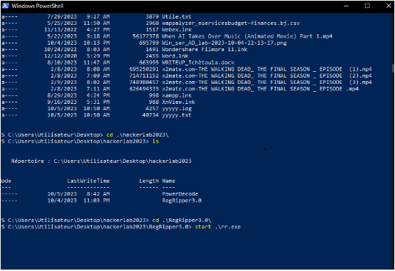
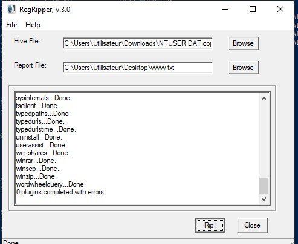
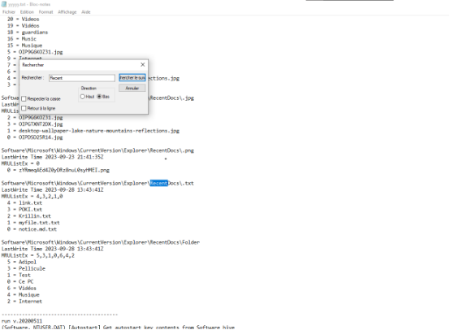

#### Categorie: Forensic 
#### **Author**: W1z4rd
#### Solve: 17/20 
#### Points: 200 pts (at first)| 120 pts (at end)

#### Write-up by: Amoweak ([Amoweak](https://))
#### Description :
#### **[FR]**
L'équipe d'investigation en réponse aux incidents (IR) des gardiens des trésors a mené une opération de perquisition chez un membre du groupe DokounXosu.

Vous êtes chargé de trouver les éléments suivants :

- Le fichier le plus récemment modifié par l'utilisateur sur la machine, y compris son extension
- La date à laquelle ce fichier a été ouvert, au format yyyy-mm-dd hh:mm:ss
- Le nom du répertoire où se trouve ce fichier

**[EN]**

The Treasure Guardians’ Incident Response Investigation (IR) team conducted a search operation at the home of a member of the DokounXosu group.

You are responsible for finding the following:

- The file most recently modified by the user on the machine, including its extension
- The date this file was opened, in the format yyyy-mm-dd hh:mm:ss
- The name of the directory where this file is located

#### Information
**Format du FLAG**: CTF_**filename**:**yyyy-mm-dd hh:mm:ss**:**Nomdurepertoire**


- ### Write-Ups
  ### FR Version
  > Challenge
  

Après téléchargement du fichier, première chose, on vérifie le type du fichier, et il s’avère que c’est un Microsoft Windows registry file.


Nous remarquons aussi que l'extension `.copy0` ne sert à rien de notre cas donc nous pouvons l'enlever

On cherchait sur internet un outil permettant d’ouvrir le fichier. L’observateur des événements de Windows peut le faire d’après une recherche. On essaie donc de l’ouvrir avec mais on reçoit une erreur « fichier endommagé ».

 
On cherche donc un autre moyen. Après des recherches, un membre de l’équipe 
« [Jekyll](https://twitter.com/Ted_Kouhouenou) » découvre un outil qui pourrait nous aider. Il s’agit de cet outil : 
**RegRipper 3.0** 


 
> Source : `https://github.com/keydet89/RegRipper3.0` 

Je clone le répertoire 
```bash
git clone https://github.com/keydet89/RegRipper3.0
```

Puis j'exécute la commande `rr.exe` qui nous permettra de démarrer l’outil.



Le logiciel s'exécute 
Ensuite, on entre le fichier où on veut récupérer les informations et le fichier qui recevra les résultats, puis on clique sur « rip ! » pour lancer l’action.


On examine ensuite le fichier après la sortie du résultat. 
Après examination, on note un **faux flag**  et un mot clé « Récent » et on se charge aussi de découvrir la date la plus récente dans le fichier, qui s’avère être le **28 septembre 2023.** 


Chose intrigante ici est le mot clé  **MRUListEx** .
Après des recherches, on note qu’il fallait se concentrer sur l’ordre des numéros « le premier est le dernier objet ouvert », et non sur le chiffre pour représenter l’ordre d’ouverture.

On sait que le format du Flag est comme ceci :
- CTF_**filename**:**yyyy-mm-dd hh:mm:ss**:**Nomdurepertoire** 


 Ainsi donc, on obtient comme flag : CTF_link.txt:2023-09-28 13:43:41:Adipol.

Flag : `CTF_link.txt:2023-09-28 13:43:41:Adipol.`

----------------------------------------------------------
### EN Version

 ### FR Version
  > Challenge
  

After downloading the file, the first thing we do is check the file type, and it turns out to be a Microsoft Windows registry file.


We also notice that the `.copy0` extension is useless in our case, so we can remove it.

We search the Internet for a tool to open the file. Windows Event Viewer can do it, according to a search. We try to open it with this tool, but receive a "damaged file" error.

 
So we looked for another way. After some research, a member of the team 
"[Jekyll](https://twitter.com/Ted_Kouhouenou)" discovered a tool that could help us. It's this tool: 
**RegRipper 3.0** 


 
> Source : `https://github.com/keydet89/RegRipper3.0` 

I clone the repository
```bash
git clone https://github.com/keydet89/RegRipper3.0
```

Then I run the rr.exe command to start the tool.


The software runs 
Next, enter the file from which you want to retrieve the information and the file that will receive the results, then click on "rip!" to launch the action.


We then examine the file after outputting the result. 
After examination, we note a **false flag** and a keyword "Recent" and we also take care of discovering the most recent date in the file, which turns out to be **September 28, 2023.** 


What's intriguing here is the keyword **MRUListEx** .
After some research, we note that we had to focus on the order of the numbers "the first is the last object opened", and not on the number to represent the order of opening.

We know that the Flag format is like this: 
- CTF_**filename**:**yyyy-mm-dd hh:mm:ss**:**DirectoryName** 


 This gives us the flag : CTF_link.txt:2023-09-28 13:43:41:Adipol.

Flag : `CTF_link.txt:2023-09-28 13:43:41:Adipol.`