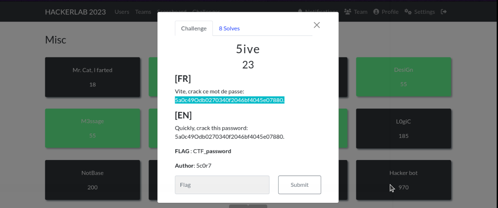
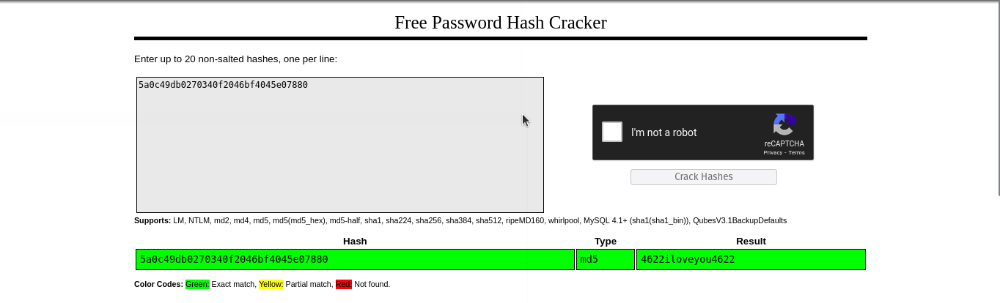

##### Categorie: Misc 
##### **Author**: 5c0r7 
#### **Flag Format** : CTF_**password** 
#### Solve: 8/19
#### Description :
### [FR]
Vite crack ce mot de passe :
### [EN]
Quickly crack this password:

- ### Write-ups 

   - ### FR Version 

#### Information : 
`5a0c49Odb0270340f2046bf4045e07880.` 

A vue d'œil il s'agit d'un **hash** et l'indice nous aide à bien comprendre que c'est bien un hash .
Mais évidemment ce n'est pas si simple de le cracker, pourquoi ? parcequ'un Hash ne contient que des caractères hexadécimales.
Le système hexadécimal utilise **les chiffres 0 à 9 et les lettres de A à F qui correspondent aux nombres décimaux 10 à 15**.
Nous pouvons remarquer que dans notre cas ce n'est pas pareil.

##### Remarque: 
 Ce hash contient des caractères  non hexadécimaux , un (O)  et un point (H.)

Apres les avoir retirés on essaie de cracker le mot de passe avec un des nombreux outils qui peuvent nous permettre d'y arriver, j'ai décidé d'utiliser [CrackStation](https://crackstation.net/) 

On colle le nouveau hash obtenu (celui sans les caractères gênants) et on clique sur 
*Crack Hashes* juste à droite 
Quelques secondes après nous pouvons voir que la fonction de hachage utilisée est le [MD5](https://fr.wikipedia.org/wiki/MD5)  et que  le mot de passe s'affiche dans la collone **Result** 

Donc  si on suit le format du flag donné au début du challenge, le flag est : CTF_4622iloveyou4622

Flag: `CTF_4622iloveyou4622` 

-------------------------------------------------------------------

   - ### ENG Version 

#### Information : 
`5a0c49Odb0270340f2046bf4045e07880.` 

At first glance it is a **hash** and the index helps us to understand that it is indeed a hash.
But obviously it's not that easy to crack it, why? because a Hash only contains hexadecimal characters.
The hexadecimal system uses **the numbers 0 to 9 and the letters A to F which correspond to the decimal numbers 10 to 15**.
We can notice that in our case it is not the same.
##### Noticed: 
  This hash contains non-hexadecimal characters, an (O) and a period (.)

After removing them we try to crack the password with one of the many tools that can help us do this, I decided to use  [CrackStation](https://crackstation.net/) 

We paste the new hash obtained (the one without the annoying characters) and click on *Crack Hashes* just to the right
A few seconds later we can see that the hash function used is [MD5](https://fr.wikipedia.org/wiki/MD5) and that the password is displayed in the **Result** column 

So if we follow the format of the flag given at the start of the challenge, the flag is: CTF_4622iloveyou4622

Flag: `CTF_4622iloveyou4622` 