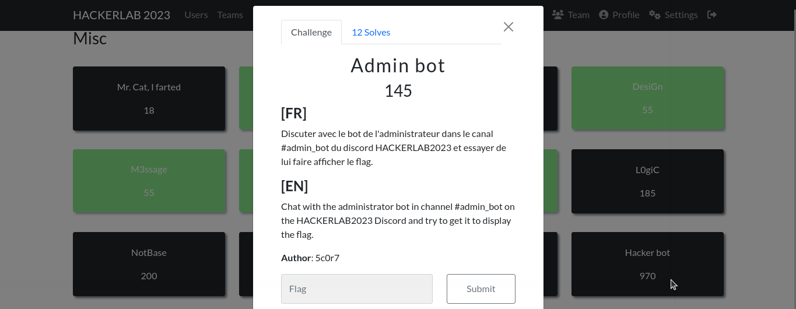
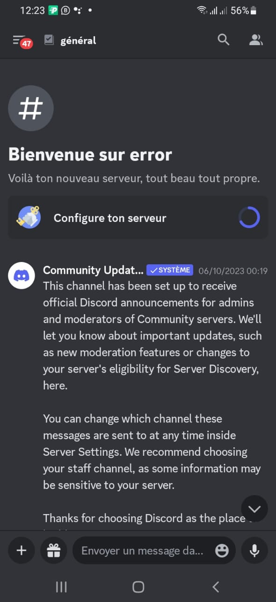
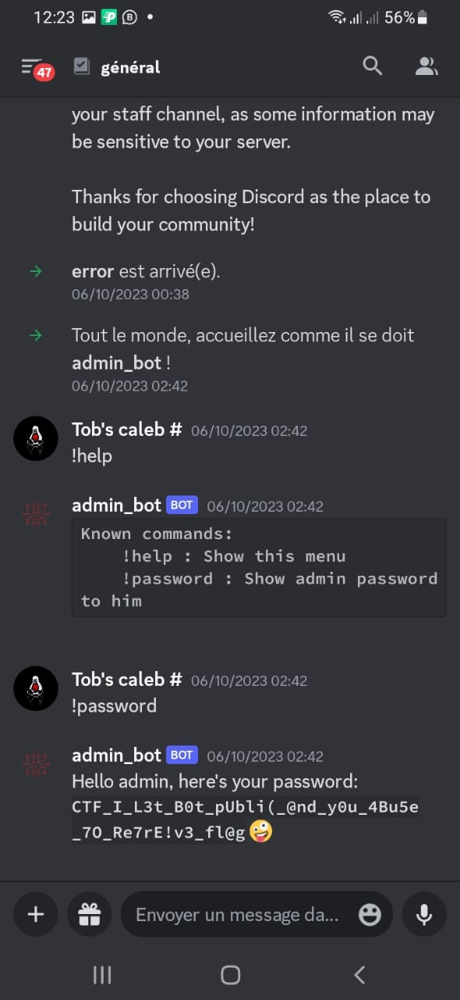

#### Categorie: Misc 
#### **Author**: 5c0r7
#### Solve: 12/20 
#### Points: 200 pts (at first)| 145 pts (at end)

#### Write-up by: [Jekyll](https://twitter.com/Ted_Kouhouenou) & [error]() & [Gojo](https://twitter.com/GOMEZJohan5) 
#### Description :
#### **[FR]**
Discuter avec le bot de l'administrateur dans le canal #admin_bot du discord HACKERLAB2023 et essayer de lui faire afficher le flag.
#### **[EN]**
Chat with the administrator bot in channel #admin_bot on the HACKERLAB2023 Discord and try to get it to display the flag.

## Solution :
### Fr Version : 

`For ENG version scroll down` 

Pour ce chall, il faut se documenter sur les bot discord .Tout d'abord il faut créer un serveur discord sur lequel on est admin , puis créer un bot sur le serveur. 
Apres avoir créé le bot nous ajoutons l'ID (l'identifiant du bot) du hackerlab au bot qu'on vient de créer pour pouvoir inviter le bot du hackerlab sur notre serveur.

Donc le procédé se passe avec ce genre le lien
`https://discordapp.com/oauth2/autorize?client_id=4902&scope=bot`
Dans la section `client_id` nous specifions l'ID du bot en question qui est 
`1154312717918801930` 

Le bot est maintenant invite, nous pouvons lui demander le mot de passe maintenant.

Flag : `CTF_I_L3t_B0t_pUbli(_@nd_y0u_4Bu5e_7O_Re7rE!v3_fl@g` 

-------------------------------------------------------------------------------

### Eng Version 

For this challenge, you need to read up on Discord bots. First of all, you need to create a Discord server on which you are an admin, then create a bot on the server.
After creating the bot we add the ID (the bot identifier) of the hackerlab to the bot that we have just created to be able to invite the hackerlab bot to our server.

So the process happens with this type of link
`https://discordapp.com/oauth2/authorize?client_id=4902&scope=bot`
In the `client_id` section we specify the ID of the bot in question which is
`1154312717918801930`

The bot is now prompted, we can ask it for the password now.

Flag : `CTF_I_L3t_B0t_pUbli(_@nd_y0u_4Bu5e_7O_Re7rE!v3_fl@g` 

