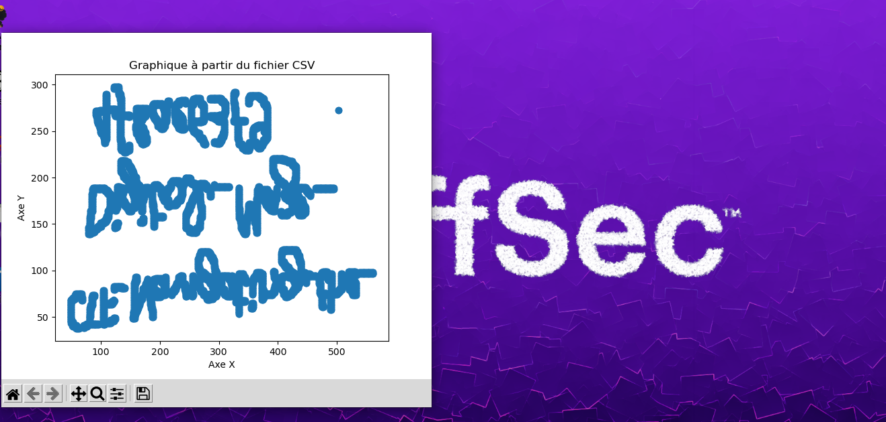

#### Categorie: Misc
#### **Author**: r3s0lv3r
#### Solve: 16/20 
#### Points: 70 pts (at first)|   55 pts (at end)
#### Files: [dahomeyArt.csv](Images/dahomeyArt.csv)

#### Write-up by: [0xJekyll](https://twitter.com/Ted_Kouhouenou) 

#### **[FR]**
Pouvez-vous me sculpter ?
#### **[EN]**
Can you sculpt me ?

## Solution :
### Fr Version : 

`For ENG version scroll down` 


Nous téléchargeons le fichier donné en description, il s'agit d'un fichier Excel au format `.csv`

En ouvrant le fichier en question avec *OnlyOffice* (Vive l'Open Source), nous remarquons des chiffres.

En nous référant à la description donnée nous arrivons à penser qu'il s'agit de coordonnées .
Bon essayons alors d'afficher ces coordonnes sur un plan pour voir ce que cela forme comme *sculpture*.
Pour cela, nous utilisons ce script python pour afficher ladite sculpture 
Installons-les dépendances pour ce genre de casse-tête . 

- ###### Pandas 

```bash
pip3 install pandas
```

- ##### Matplotlib 
```bash
pip install matplotlib
```

Le script maintenant 

```python3
#!/usr/bin/python3

import pandas as pd
import matplotlib.pyplot as plt

# Chargez les données CSV dans un DataFrame
data = pd.read_csv('dahomeyArt.csv')

# Par exemple, si vous avez une colonne 'x' et une colonne 'y' dans votre fichier CSV,
# vous pouvez créer un graphique en utilisant plt.scatter pour un nuage de points
plt.scatter(data['X'], data['Y'])

# Vous pouvez personnaliser le graphique en ajoutant un titre et des labels d'axe
plt.title('Graphique à partir du fichier CSV')
plt.xlabel('Axe X')
plt.ylabel('Axe Y')

# Affichez le graphique
plt.show()

```

Et après quelques secondes, nous avons


L'image en question a l'air d'être à l'envers et d'avoir eu en plus un effet miroir 

Apres quelques tours de tête, nous pouvons réécrire le flag
`CTF_Navigating_the_Digital_Maze_4f8ae63f9`

Flag : `CTF_Navigating_the_Digital_Maze_4f8ae63f9` 


--------------------------------------------------------------------

### Eng Version


We download the file given in description, it is an Excel file in `.csv` format

By opening the file in question with *OnlyOffice* (Long live Open Source), we notice a
numbers. 

By referring to the description given we come to think that it is about coordinates.
Well, let's try to display these coordinates on a plan to see what *sculpture* looks like.
For this, we use this python script to display said sculpture
Let's install dependencies for this kind of puzzle.

- ###### Pandas 

```bash
pip3 install pandas
```

- ##### Matplotlib 
```bash
pip install matplotlib
```

The script now

```python3
#!/usr/bin/python3

import pandas as pd
import matplotlib.pyplot as plt

# Chargez les données CSV dans un DataFrame
data = pd.read_csv('dahomeyArt.csv')

# Par exemple, si vous avez une colonne 'x' et une colonne 'y' dans votre fichier CSV,
# vous pouvez créer un graphique en utilisant plt.scatter pour un nuage de points
plt.scatter(data['X'], data['Y'])

# Vous pouvez personnaliser le graphique en ajoutant un titre et des labels d'axe
plt.title('Graphique à partir du fichier CSV')
plt.xlabel('Axe X')
plt.ylabel('Axe Y')

# Affichez le graphique
plt.show()

```

And after a few seconds we have


The image in question appears to be upside down and also to have had a mirror effect
(Yes i know my wallpapper is nice !) 

After a few headaches, we can rewrite the flag
`CTF_Navigating_the_Digital_Maze_4f8ae63f9`

Flag : `CTF_Navigating_the_Digital_Maze_4f8ae63f9` 

