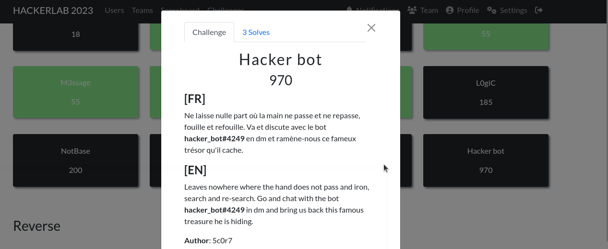
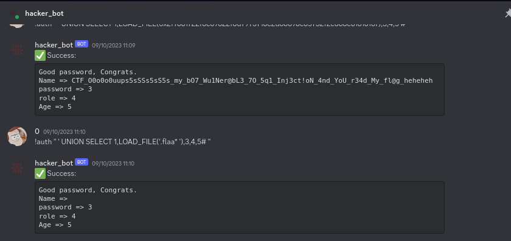

#### Categorie: Misc 
#### **Author**: 5c0r7
#### Solve: 3/20 
#### Points: 1000 pts (at first)| 930 pts (at end)

#### Write-up by: [Jekyll](https://twitter.com/Ted_Kouhouenou) 
#### Description :
### [FR]
Ne laisse nulle part où la main ne passe et ne repasse, fouille et refouille. Va et discute avec le bot **hacker_bot#4249** en dm et ramène-nous ce fameux trésor qu'il cache.
### [EN]
Leaves nowhere where the hand does not pass and iron, search and re-search. Go and chat with the bot **hacker_bot#4249** in dm and bring us back this famous treasure he is hiding.

## Solution :
### Fr Version : 

`For ENG version scroll down` 

##### Information : 
Lien du Discord  du HackerLab2023 : [Discord](https://discord.gg/spHpZuS) 
Le bot est disponible depuis le discord du HackerLab2023

Ce challenge est assez particulier, il s'agit d'essayer de faire cracher le flag à un bot qui a l'air un peu strict et qui a l'air de ne rien vouloir laisser passer.

Premierement nous essayons de savoir ce qu'il est possible de faire en faissant un peu de reconnaissance .

Nous remarquons qu'il nous recommande une commande à utiliser 
cette commande ( ! help) nous permet d'afficher l'aide  et d'avoir plus d'informations sur les différentes commandes pouvant être utilisées.

Parmi ces commandes, celle qui attire notre attention est la commande
` !auth` qui fait sûrement référence à une authentification.
Afin de l'utiliser, il faut fournir en paramètre un mot de passe 

` !auth admin_password` par exemple

Nous tentons d'utiliser cette commande  et surtout  de vérifier comment l'utiliser pour contourner la vérification (comme ferait tout bon hacker).

Hum, évidemment rien ne passe.Nous essayons de faire autre chose, pour cela qu'est ce qui pourrait nous permettre d'obtenir des infos chez un bot a part le questionner stupidement alors qu'on sait qu'on n'aura pas la réponse, à un moment, on se dit que s'il doit nous envoyer un flag c'est qu'il le stocke, donc il avoir une base de donnée donc on pense commencer une **SQLI**. 

Nous tentons plusieurs methode possible pour obtenir le flag ,en passant par plusieurs 

Flag : `CTF_O0o0o0uups5sSSs5sS5s_my_bO7_Wu1Ner@bL3_7O_5q1_Inj3ct!oN_4nd_YoU_r34d_My_fl@g_heheheh` 

-------------------------------------------------------------------------

### Eng Version

##### Information : 
Lien du Discord  du HackerLab2023 : [Discord](https://discord.gg/spHpZuS) 
Le bot est disponible depuis le discord du HackerLab2023

Ce challenge est assez particulier, il s'agit d'essayer de faire cracher le flag à un bot qui a l'air un peu strict et qui a l'air de ne rien vouloir laisser passer.

Premierement nous essayons de savoir ce qu'il est possible de faire en faissant un peu de reconnaissance .

Nous remarquons qu'il nous recommande une commande à utiliser 
cette commande ( ! help) nous permet d'afficher l'aide  et d'avoir plus d'informations sur les différentes commandes pouvant être utilisées.

Parmi ces commandes, celle qui attire notre attention est la commande
` !auth` qui fait sûrement référence à une authentification.
Afin de l'utiliser, il faut fournir en paramètre un mot de passe 

` !auth admin_password` par exemple

Nous tentons d'utiliser cette commande  et surtout  de vérifier comment l'utiliser pour contourner la vérification (comme ferait tout bon hacker).

Hum, évidemment rien ne passe.Nous essayons de faire autre chose, pour cela qu'est ce qui pourrait nous permettre d'obtenir des infos chez un bot a part le questionner stupidement alors qu'on sait qu'on n'aura pas la réponse, à un moment, on se dit que s'il doit nous envoyer un flag c'est qu'il le stocke, donc il avoir une base de donnée donc on pense commencer une **SQLI**. 

Nous tentons plusieurs methode possible pour obtenir le flag ,en passant par plusieurs 

Flag : `CTF_O0o0o0uups5sSSs5sS5s_my_bO7_Wu1Ner@bL3_7O_5q1_Inj3ct!oN_4nd_YoU_r34d_My_fl@g_heheheh` 
