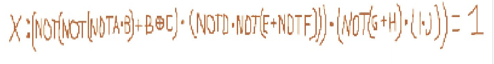
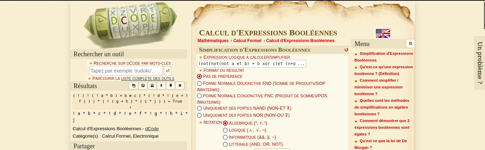
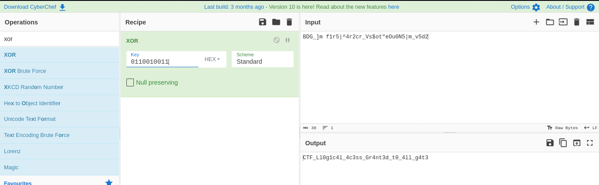

#### Categorie: Misc
#### **Author**: r3s0lv3r
#### Solve: 4/20 
#### Points: 200 pts (at first)|   185 pts (at end)
#### Files: [glude.png](Files/glude.png) , [secretCode.txt](Files/secretCode.txt)  
#### Write-up by: [0xJekyll](https://twitter.com/Ted_Kouhouenou) 

#### **[FR]**
Pour atteindre le trésor caché au cœur d'une grotte mystérieuse, vous devrez résoudre une série d'énigmes destinées à désactiver un système de sécurité complexe. Les archéologues qui ont exploré la grotte ont laissé de précieux indices pour vous guider dans cette aventure passionnante.
#### **[EN]**
To reach the treasure hidden in the heart of a mysterious cave, you'll have to solve a series of riddles designed to deactivate a complex security system. The archaeologists who explored the cave have left valuable clues to guide you on this exciting adventure.

## Solution :
### Fr Version : 

`For ENG version scroll down` 

Pour ce challenge, nous avons deux fichiers à utiliser.En ouvrant le premier fichier qui est une image, nous voyons une écriture bizarre écrite sur l'image :

Le nom du challenge ainsi que cette inscription nous rappelle notre cour d'algèbres de bool
(Cours de premiere année)
Nous cherchons un moyen de le décoder, sur papier cela nous prendrait du temps, et comme nous sommes paresseux, nous décidons de chercher un autre moyen de nous tombons sur un lien sur  **dcode**  qui pourrait nous aider : [dcode-bool](https://www.dcode.fr/calcul-expressions-booleennes) 

Nous entrons donc l'équation que nous avons
`(not(not(not a et b) + b xor c)et (n+ot d et not(e + not f))) et (not(g + h)et (i et j)) = 1` 
Et nous avons un résultat

Résultat :
`! a * b * c * ! d * ! e * f * ! g * ! h * i * j` 
Ici, nous pouvons assimiler les caractères avec des ` !` comme des `0` et le reste comme des `1` Nous obtenons alors `0110010011` mais à quoi cela pourrait bien servir ?
Nous nous rappelons que nous avions obtenu un second fichier et que son contenu nous paraissait bizarre
Voici son contenu 
`BDG_]m f1r5|^4r2cr_Vs$ot"eOu0N5|m_v5d2` 

On dirait du Xor (juste du guessing comme d'hab) 
On essaie d'utiliser [Cyberchef](https://gchq.github.io/CyberChef/) et l'on tente d'utiliser les binaires obtenus comme Clef

Bingo!!!!!!!!!!!!
Flag : `CTF_Ll0g1c4l_4c3ss_Gr4nt3d_t0_4ll_g4t3`

-------------------------------------------------------------------
### Eng Version 

For this challenge we have two files to use. When opening the first file which is an image we see a strange writing written on the image:

The name of the challenge as well as this inscription reminds us of our Bool algebra course
(First year course)
We are looking for a way to decode it, on paper it would take us time, and as we are lazy, we decide to look for another way but we come across a link on **dcode** which could help us: [dcode-bool ](https://www.dcode.fr/calcul-expressions-booleennes)

So we enter the equation that we have 
`(not(not(not a et b) + b xor c)et (n+ot d et not(e + not f))) et (not(g + h)et (i et j)) = 1` 

And we have a result

Result :
`! a * b * c * ! d * ! e * f * ! g * ! h * i * j` 
Here we can equate the characters with `!` as `0` and the rest as `1` We then obtain `0110010011` but what use could that possibly be?
We remember that we had obtained a second file and that its contents seemed strange to us
Here are its contents
`BDG_]m f1r5|^4r2cr_Vs$ot"eOu0N5|m_v5d2` 

Looks like Xor (just guessing as usual)
We try to use [Cyberchef](https://gchq.github.io/CyberChef/) and we try to use the binaries obtained as Key

Bingo!!!!!!!!!!!!
Flag : `CTF_Ll0g1c4l_4c3ss_Gr4nt3d_t0_4ll_g4t3`
