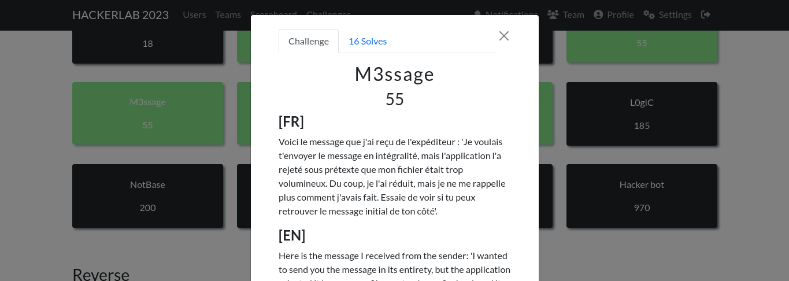

#### Categorie: Misc
#### **Author**: unpasswd
#### Solve: 16/20 
#### Points: 70 pts (at first)|  55 pts (at end)
### File : [message](./Files/message)
#### Write-up by: [Jekyll]()
#### Description : 

#### **[FR]**

Voici le message que j'ai reçu de l'expéditeur : 'Je voulais t'envoyer le message en intégralité, mais l'application l'a rejeté sous prétexte que mon fichier était trop volumineux. Du coup, je l'ai réduit, mais je ne me rappelle plus comment j'avais fait. Essaie de voir si tu peux retrouver le message initial de ton côté'.

#### **[EN]**
Here is the message I received from the sender: 'I wanted to send you the message in its entirety, but the application rejected it because my file was too large. So, I reduced it, but I don't remember how I did it. Please see if you can find the original message on your side.'


## Solution :
### Fr Version : 

`For ENG version scroll down` 



Nous recuperons le fichier puis verifions de quel type il est 

```bash
~/Downloads → file message
message: zlib compressed data
```
il s'agit donc d'un fichier zlib 