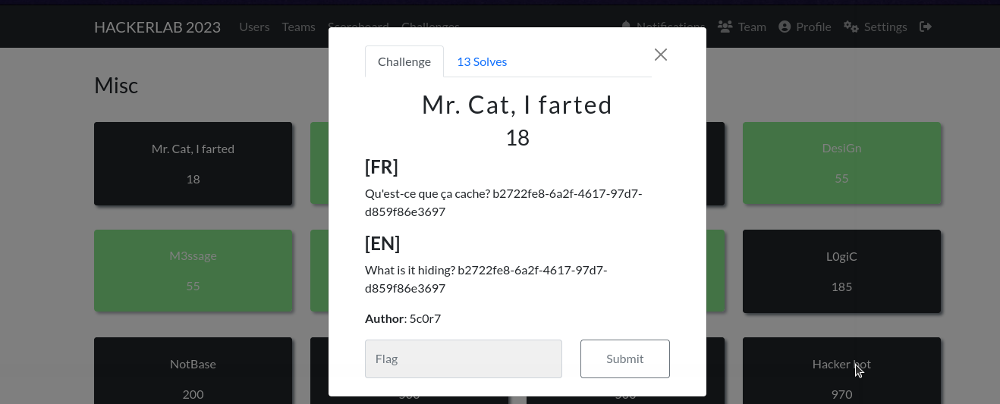

#### Categorie: Misc
#### **Author**: 5c0r7
#### Solve: 13/20 
#### Points: 30 pts (at first)| 18 pts (at end)

#### Write-up by:[0xJekyll](https://twitter.com/Ted_Kouhouenou) 

### Description : 
#### **[FR]**
Qu'est-ce que ça cache? b2722fe8-6a2f-4617-97d7-d859f86e3697
#### **[EN]**
What is it hiding? b2722fe8-6a2f-4617-97d7-d859f86e3697

## Solution :
### Fr Version
`For ENG version scroll down` 

On commence avec un challenge, deja nous avons juste un identifiant dont on n'a aucune info et un nom de chall bizarre aussi, en français le nom donne "Mr chat j'ai pete", je me suis mise à pensée a [kaeloo](https://fr.wikipedia.org/wiki/Kaeloo) évidemment je me suis crée une fausse piste tout seul.
En me répétant le nom du challenge plusieurs fois dans ma tête j'ai remarqué que le nom sonnait comme **Chatgpt** et je suis rappelé que l'une des fonctionnalités de chatgpt c'était de partager des chats et que chaque partage de chats avait  un identifiant différent (normal) j'ai donc essayé d'utiliser cet identifiant qui est en fait un [UUID](https://fr.wikipedia.org/wiki/Universally_unique_identifier)
comme identifiant de chat partagé

`https://chat.openai.com/share/b2722fe8-6a2f-4617-97d7-d859f86e3697` 
et je crée ce lien

Flag : `CTF_Welc0m3_t0_hackerlab_By_0PEN@!` 
 

### Eng Version

We start with a challenge, already we just have an identifier for which we have no information and a weird chall name too, in French the name is "Mr chat j'ai pete", I started thinking about [kaeloo ](https://fr.wikipedia.org/wiki/Kaeloo) obviously I created a false trail on my own.
As I repeated the name of the challenge several times in my head I noticed that the name sounded like **Chatgpt** and I was reminded that one of the features of chatgpt was to share chats and that each sharing of cats had a different identifier (normal) so I tried to use this identifier which is in fact a [UUID](https://fr.wikipedia.org/wiki/Universally_unique_identifier)
as shared chat ID

`https://chat.openai.com/share/b2722fe8-6a2f-4617-97d7-d859f86e3697` 
and I create this link 

Flag : `CTF_Welc0m3_t0_hackerlab_By_0PEN@!` 
 
