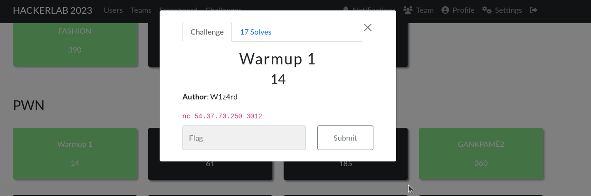
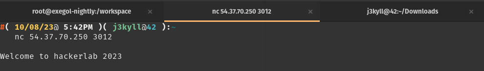
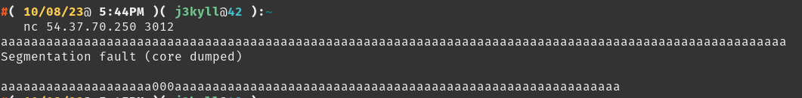
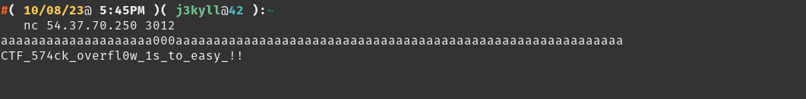

#### Categorie: PWN 
#### **Author**: W1z4rd
#### Solve: 3/20 
#### Points: 30 pts (at first)| 14 pts (at end)

#### Write-up by: Jekyll ([0xJekyll](https://twitter.com/Ted_Kouhouenou))

- ### Write-Ups

    - FR Version

#### Information : 
`nc 54.37.70.250 3012`
Nous avons comme information l'adresse **Ip** et le **port** ,et nous pouvons nous connecter au serveur via la commande **Netcat** (`nc`)

Tentons voir 

Lorsqu'on se connecte nous avons ce message de bienvenue, mais rien d'autre ne s'affiche à l'écran, c'est comme si une entrée était attendue de notre part 

Ne sachant pas quoi entrer, vaut mieux entrer n'importe quoi.

Bon j'ai entrer un certains nombre de `a` pour voir ce qu'on aura comme sortie , et nous avons un `segmentation fault` .Le core dump fait référence à l'enregistrement de l'état du programme, c'est à dire de ses ressources en mémoire et en processeur.

Cela me fait aussi penser que ce challenge peut bien etre du Stack Overflow
Ce qui voudrait aussi dire que ce que j'ai envoyé comme entrer est un peu trop.
Je retente en essayant de dimunier le nombre de caractere .

Voila nous avons le flag.

Flag: `CTF_574ck_overfl0w_1s_to_easy_!!`
