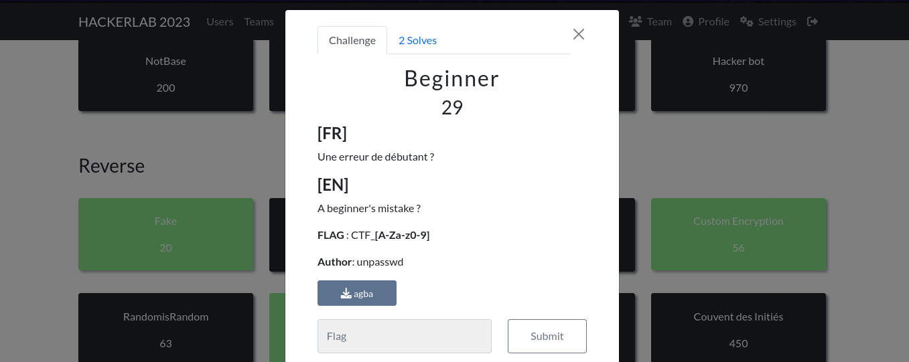
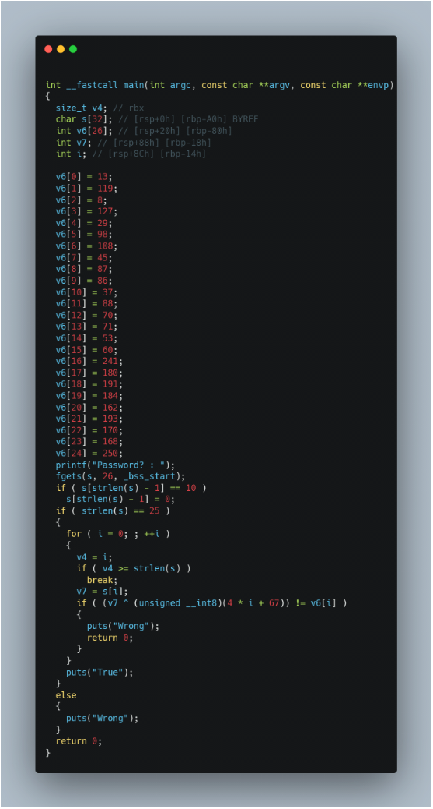
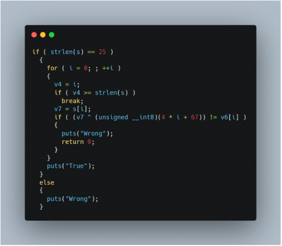

#### Categorie: Reverse 
#### **Author**: unpasswd
#### Solve: 2/20 
#### Points: 30 pts (at first)| 29 pts (at end)
#### File: [agba](./Files/agba)    

**FLAG** : CTF_**[A-Za-z0-9]**
#### Write-up by: Ov3rc0m3r ([Ov3rc0m3r](https://))

#### **[FR]**
Une erreur de débutant ?
#### **[EN]**

A beginner's mistake ?

### Write-up

### FR Version 



Lorsqu'on télécharge le fichier associé au challenge et qu'on le décompile grâce à **Hex-Rays,** (tout autre decompileur fait l'affaire) on a les instructions de la focntion main suivante:
 

Et on a la portion de code suivante qui décrit le processus de vérification du password:



La condition **if** étant etant elle-même son inverse, on a donc ecrit un script pour obtenir les différentes valeurs de v7.

Le script est le suivant : 
```C
 #include <stdio.h>
 int main (void)
 {
  int v6[26];
  int i;
  
  v6[0]=13;
  v6[1]=119;
  v6[2]=8;
  v6[3]=127;
  v6[4]=29;
  v6[5]=98;
  v6[6]=108;
  v6[7]=45;
  v6[8]=87;
  v6[9]=86;
  v6[10]=37;
  v6[11]=88;
  v6[12]=70;
  v6[13]=71;
  v6[14]=53;
  v6[15]=60;
  v6[16]=241;
  v6[17]=180;
  v6[18]=191;
  v6[19]=184;
  v6[20]=162;
  v6[21]=193;
  v6[22]=170;
  v6[23]=168;
  v6[24]=250;


  int a;
  for(i = 0;i < 25;++i)
  {
   a = ((v6[i]) ^ (4 * i + 67));
   printf("%c",(char)a);
  
  }
  return (0);
 }
 
```

On compile avec `gcc` 

```bash
#( 10/11/23@ 2:09PM )( j3kyll@42 ):~/Downloads/Hackerlab
   gcc v.c -o rev
#( 10/11/23@ 2:12PM )( j3kyll@42 ):~/Downloads/Hackerlab
   ./rev 
N0C0N57r41N750NCr3471V17Y
```

Verifions qu'il s'agit bien du mot de passe attendu 

```bash
#( 10/11/23@ 2:12PM )( j3kyll@42 ):~/Downloads/Hackerlab
   ./agba 
Password? : N0C0N57r41N750NCr3471V17Y
True
```

Flag : `CTF_N0C0N57r41N750NCr3471V17Y` 

------------------------------------------------------------------

### EN Version 


When you download the file associated with the challenge and decompile it using **Hex-Rays,** (any other decompiler will do), you get the following main function instructions:
 

The following code describes the password verification process:


Since the **if** condition is itself its inverse, we wrote a script to obtain the different v7 values.

The script is as follows: 
```C
 #include <stdio.h>
 int main (void)
 {
  int v6[26];
  int i;
  
  v6[0]=13;
  v6[1]=119;
  v6[2]=8;
  v6[3]=127;
  v6[4]=29;
  v6[5]=98;
  v6[6]=108;
  v6[7]=45;
  v6[8]=87;
  v6[9]=86;
  v6[10]=37;
  v6[11]=88;
  v6[12]=70;
  v6[13]=71;
  v6[14]=53;
  v6[15]=60;
  v6[16]=241;
  v6[17]=180;
  v6[18]=191;
  v6[19]=184;
  v6[20]=162;
  v6[21]=193;
  v6[22]=170;
  v6[23]=168;
  v6[24]=250;


  int a;
  for(i = 0;i < 25;++i)
  {
   a = ((v6[i]) ^ (4 * i + 67));
   printf("%c",(char)a);
  
  }
  return (0);
 }
 
```

Compile with `gcc`. 

```bash
#( 10/11/23@ 2:09PM )( j3kyll@42 ):~/Downloads/Hackerlab
   gcc v.c -o rev
#( 10/11/23@ 2:12PM )( j3kyll@42 ):~/Downloads/Hackerlab
   ./rev 
N0C0N57r41N750NCr3471V17Y
```

Let's check that this is indeed the expected password

```bash
#( 10/11/23@ 2:12PM )( j3kyll@42 ):~/Downloads/Hackerlab
   ./agba 
Password? : N0C0N57r41N750NCr3471V17Y
True
```

Flag : `CTF_N0C0N57r41N750NCr3471V17Y` 
