#### Categorie: Reverse
#### **Author**: 5c0r7
#### Solve: 8/20 
#### Points: 70 pts (at first)|  63 pts (at end)
#### Files: [randomisrandom](Files/randomisrandom)

#### Write-up by: [Gojo]() 

## Write-up
## Fr Vension
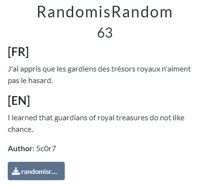
Un challenge sur du reverse, le titre déjà me parlais, Randmisandom, j’ai senti qu’on
aura affaire à un challenge faisant intervenir une fonction pour produire des nombres
aléatoires. Une petite lecture de la description du challenge me fait dire surement que
le random sera guessable (on peut deviner) vu qu’on nous dit que les gardiens de
trésors n’aiment pas le hasard !
Bon bon bon, Et si on mettait la main à la patte ??
Premier réflexe, une fois le fichier du challenge téléchargé, accordons-lui les
permissions nécessaire pour son exécution comme suit :

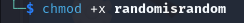
Nous pouvons donc l’exécuter :
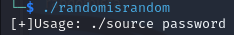

Ah ! Son exécution nécessite un certain password, je le réexécute alors cette fois-ci
avec un mot de passe totalement fictif :

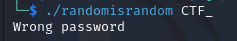
J’obtiens le message, wrong password, zut ! Je m’y entendais un peu :)
C’est du reverse, alors quoi de mieux que l’utilisation d’un outil reverse comme Ghidra
pour mieux analyser le code source !
Pour ceux qui ne savent pas, ghidra est tout simplement un outil (l’un des meilleurs)
utilisé dans le monde du reverse, il nous permet de décompiler des programmes pour
avoir un code qui se rapproche du code source d’origine de notre code programme !
On y va !
L’utilisation de ghidra est super intuitive, vous n’aurez donc pas de mal à uploader
votre binary (le fichier du challenge)
A gauche, dans le volet `Functions` , je recherche la fonction principale `main`  :

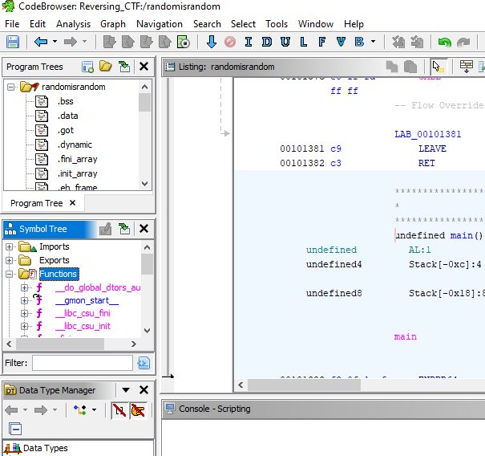

Bingo!
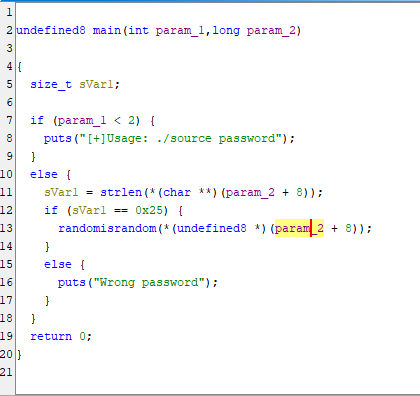
Voilà notre fonction main, Elle n’est pas difficile à comprendre et demande au
minimum un peu de notion en coding. Nous pouvons donc observer à la 7ieme ligne
que la fonction vérifie si au moins un argument est passé en paramètres, dans le cas
contraire il affiche le texte : **[+]Usage: ./source password**  
(Si vous vous en souvenez,c’est le même message qu’on a obtenu lors de notre premier appel du binary !).

Ensuite à la ligne `11` , une variable `sVar1`  a qui on affecte la valeur du nombre de
caractères saisi par l’utilisateur, ensuite à la ligne `12` , on check si la variable `sVar1` 
donc le nombre de caractères de l’utilisateur est égale à `0x25`  en hexadécimal, un
calcul rapide avec ma calculatrice sur mon ordinateur me donne `37`  décimal comme
sur la figure suivante :
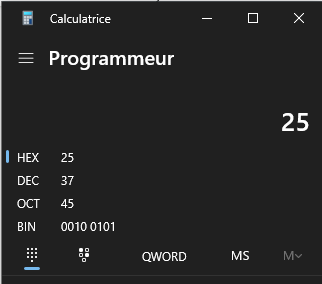
Nous devons donc entrer notre mot de passe de telle sorte qu’il comporte `37` 
caractères ! Dans le cas contraire, on nous affiche : Wrong password comme le dit la
ligne `16` .
Un indice de trouver, on avance bien, vous ne trouvez pas ?? :)
Bof on continue la lecture du code, ensuite à la ligne `13` , si le nombre de caractères
est bon c’est-à-dire égale à `37` , la fonction `randomisrandom` est appelé !!!
Pour afficher le contenu de cette fonction, rien de plus simple, double cliquez sur son
nom !
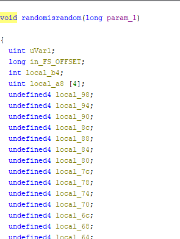
Vous avez déjà peur ? Pas besoin, on scrolle vers le bas pour analyser notre code
A la ligne, `94` , qui retient mon intention, je remarque que si notre password ne
respecte pas certaines conditions, on nous affichera  **Wrong password !** 

Vaut mieux checker cette condition que d’analyser le code au complet !
Cette ligne récupère le premier caractère de notre password, ensuite, le convertit en
int, puis fait un `XOR`  avec la valeur de `uvar1`  pour ensuite comparer le résultat final à
l’élément situé dans le tableau `local_a8`  à la même position.
Elle fait la même chose avec le second élément de notre password qui sera comparé
au second élément de `local_a8` , ensuite la même chose pour le troisième élément et
ainsi de suite jusqu’à finir nos `37`  éléments.
Alors c’est quoi `local_b4`  ? Tout simplement un entier initialisé à `0`  à la ligne `83`  et qui
s’incrémente de `1` à la ligne `98`  à chaque tour de boucle, son principal but est de
pouvoir parcourir le tableau local_a8 et de pouvoir parcourir chaque caractère de
notre password !
Ensuite, `local_a8`, est un tableau initialisé depuis la ligne `46`  !
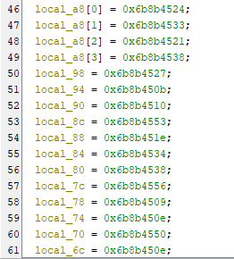
Ici on voit qu’il contient uniquement 4 éléments, ce qui selon moi n’est pas possible
suite a notre raisonnement, je me dis donc que **Ghidra**  a fait une petite erreur de
décompilation, parce que si vous comptez de la ligne `46` à la ligne `82` 

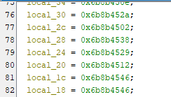
On remarque bien qu’on a exactement `37`  lignes, on toute simplicité, voilà notre
tableau local_a8 avec ses valeurs (Ligne `46`  à ligne `82` ) !
La seule composante dont on ignore encore le but, c’est `uvar1`  !

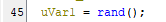
A la ligne `45` , on remarque bien que `uvar1`  récupère la valeur retournée par la
fonction `rand()` , un double clique sur le nom de la fonction nous laisse apercevoir
ceci :

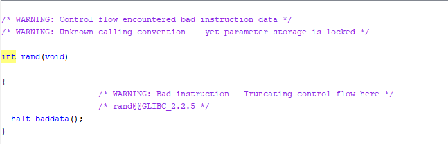

Rien de bien intéressant, en gros, une fonction rand est appelé et puis le nombre
choisi est stocké dans `uvar1`  !
Mais est-ce que vous vous souvenez de la description du chall ??
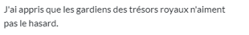
Je doute donc que la fonction `rand()`  soit vraiment aléatoire !
Il ne reste plus qu’à vérifier quelle est sa valeur à chaque fois que nous exécutons le
code, rien de plus exaltant que l’utilisation de gdb (Il s’agit d’un désassembleur, qui
nous permet de savoir comment notre binary est gère en mémoire)
Faites des recherches pour mieux comprendre si vous êtes nouveaux dans le
domaine ! (ChatGPT est votre ami !)

Allons-y !

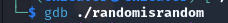
J'utilise une extension de gdb appelé gef, vous pouvez l’installez si nécessaire, rien de
bien compliqué !
Nous allons lancer notre programme en lui envoyant une suite de `37`  caractères
comme nous l’avons vu pour que la fonction randomisrandom soit appelé !
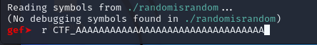
Entrez ce que vous voulez mais assurer vous d’avoir `37`  caractères sinon la fonction
randomisrandom ne sera pas appelé et donc pas de fonction `rand()` 

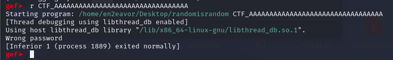

Normal ce n’est pas le bon mot de passe :)
Maintenant nous allons observer le fonctionnement de la fonction randomisrandom
dans `gdb` . Pour cela nous allons mettre un breakpoint sur cette fonction :

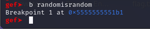
**b= breakpoint** 
Un breakpoint permet tout simplement d’arrêter notre programme à un endroit
précis lors de son exécution !
Entrer r pour lancer le programme

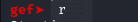
Ensuite, vous verrez

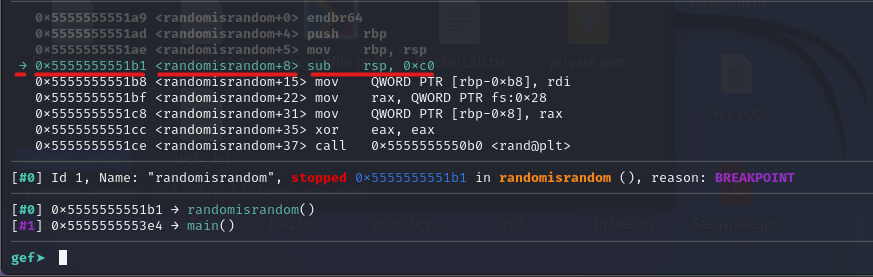
La première ligne rouge nous montre une flèche qui nous indique ou le breakpoint a
été placé, la seconde ligne indique l’adresse de l’instruction actuelle de notre fonction
et pour finir la dernière indique ce qu’il faut faire dans un langage assembleur :)
Restez avec moi notre but ne l’oubliez surtout pas, voir la valeur généré par la
fonction `rand()` . Nous allons donc nous diriger vers l’instruction qui correspond à ce
bout de code :

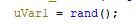

En gros on va tout simplement rechercher l’appel de la fonction `rand()`  dans gdb
Pour ce faire on va utiliser une commande ni (next instruction) pour aller vers
l’instruction suivante :
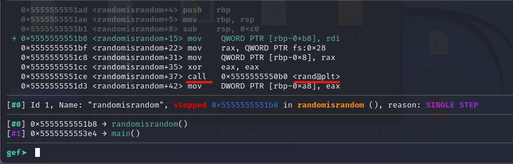

Bingo ! Ça marche
On remarque que l’instruction call (appel de fonction) de rand n’est pas loin, on fait
donc un ni jusqu’à l’atteindre.
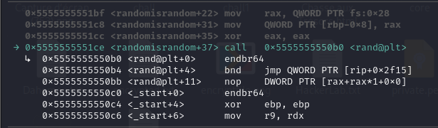
Voilà, la flèche est bien à ce niveau !
N’oublier que sa valeur est mise dans la variable uvar1
On passe donc à l’instruction qui suit avec ni
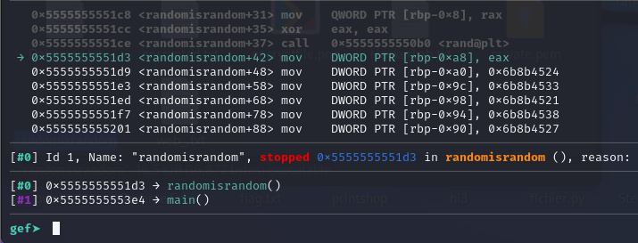
On voit donc que juste après l’appel de rand, il y’a un mov (move) de la valeur
contenue dans le registre eax dans le registre `rbp-0xa8` .
En gros, si nous voulons voir ce qui est stocké dans rbp-0xa8, nous devons laisser
cette instruction s’exécuter parce que actuellement nous sommes dessus, elle ne sait
donc pas encore exécuter, eax n’a pas encore été déplacé dans rbp-0xa8. On laisse
l’instruction s’exécuter avec ni
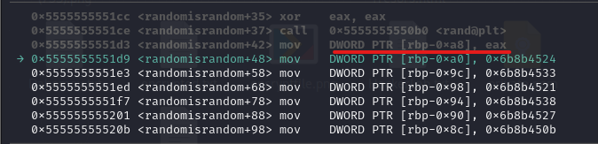
L’instruction précédente souligné en rouge
On peut donc accéder à la valeur de `rbp-0xa8`  en faisant :

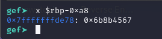
On obtient donc sa valeur : 0x6b8b4567
Pour vérifier si on obtient ce même résultat à chaque exécution du programme, je
refais ce même processus 3 ou 4 fois, à chaque fois, on obtient la même valeur !
BINGO ! On a le rand, il ne reste plus qu’à calculer ….
On a donc comme je l’avais précisé au départ :
character_of_passowrd XOR `uvar1 = local_a8[local_b4]` 
Il suffit donc de tirer le character_of_passowrd pour avoir :
`character_of_passowrd = local_a8[local_b4] XOR uvar1` 
On peut le faire manuellement pour le premier caractère qui donne :
`local_a8[0] XOR uvar1 = 0x6b8b4524 XOR 0x6b8b4567 = 67` 
Et avec python on obtient le caractère correspondant :

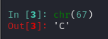
`Chr(67)` ` =>permet de trouver le caractère qui correspond à `67` 
N’oubliez pas qu’on retrouve les éléments du tableau de local_a8 dans le code fournit
par ghidra
Le calcul du XOR peut se faire sur des plateformes en ligne :)
Il suffit donc de continuer ainsi pour chaque caractère en faisant varier `local_b4` de `0
à 36` 
J’aurais pu le faire manuellement mais j’ai voulu essayer un script quand bien même
je ne suis pas vraiment doué en Scripting
J’ai obtenu le code suivant :

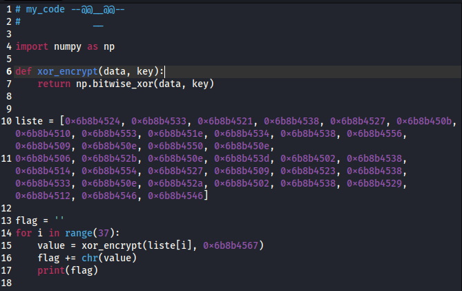

La liste contient tous les éléments de `local_a8` , j’utilise `numpy`  pour implémenter le
calcul du `XOR` 

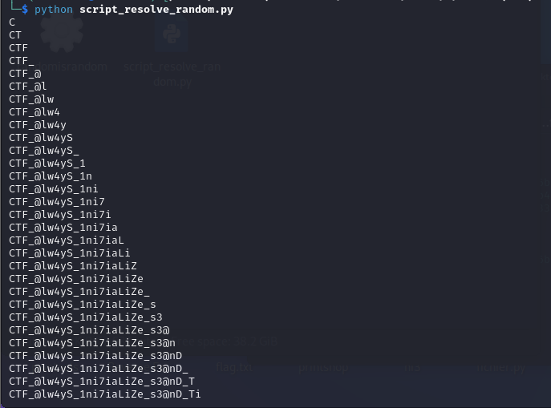

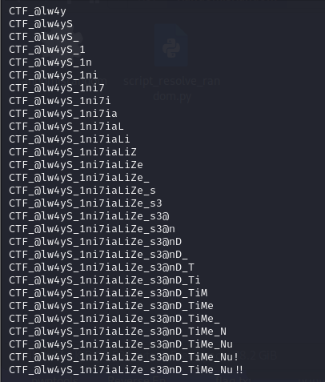

BIIIIIIIIIINGO !

gdb nous confirme que c’est le bon password !!!!
Le flag est donc : `CTF_@lw4yS_1ni7iaLiZe_s3@nD_TiMe_Nu!!` `
Comme on peut le voir les gardiens des trésors devraient penser à aimer le hasard :)
Merci !!!!!
Flag : `CTF_@lw4yS_1ni7iaLiZe_s3@nD_TiMe_Nu!!` 

-----------------------------------------------------------------------

### En Version

A reverse challenge, the title already spoke to me, Randmisandom, I felt that we
will face a challenge involving a function to produce numbers
random. A quick reading of the description of the challenge makes me surely say that
the random will be guessable (we can guess) since we are told that the guards of
treasures don't like chance!
Good good good, What if we got our hands dirty??
First reflex, once the challenge file has been downloaded, let's grant it the
permissions required for its execution as follows:

So we can execute it: 

Ah! Its execution requires a certain password, so I run it again this time
with a completely fictitious password:

I get the message, wrong password, damn! I understood a little :)
It's reverse, so what's better than using a reverse tool like Ghidra
to better analyze the source code!
For those who don't know, ghidra is simply a tool (one of the best)
used in the world of reverse, it allows us to decompile programs to
have a code that is close to the original source code of our program code!
Here we go !
Using ghidra is super intuitive, so you won't have trouble uploading
your binary (the challenge file)
On the left, in the `Functions` pane, I look for the main function `main`:

Bingo!

Here is our main function, It is not difficult to understand and asks the
at least a little knowledge of coding. We can therefore observe in the 7th line
that the function checks if at least one argument is passed as parameters, in the case
otherwise it displays the text: **[+]Usage: ./source password**
(If you remember, this is the same message we got during our first call to the binary!).

Then on line `11`, a variable `sVar1` to which we assign the value of the number of
characters entered by the user, then on line `12`, we check if the variable `sVar1`
so the user's character count is equal to `0x25` in hexadecimal, a
quick calculation with my calculator on my computer gives me `37` decimal as
in the following figure: 

So we need to enter our password such that it has `37`
characters ! Otherwise, we are shown: Wrong password as it says
line `16`.
A clue to find, we're making good progress, don't you think?? :)
Well, we continue reading the code, then at line `13`, if the number of characters
is good i.e. equal to `37`, the `randomisrandom` function is called!!!
To display the content of this function, nothing could be simpler, double click on its
name !

Are you scared yet? No need, we scroll down to analyze our code
On line, `94`, which retains my intention, I notice that if our password does not
does not respect certain conditions, we will be shown **Wrong password!** 

VBetter to check this condition than to analyze the entire code!
This line gets the first character of our password, then converts it to
int, then does an `XOR` with the value of `uvar1` to then compare the final result to
the element located in the array `local_a8` at the same position.
It does the same thing with the second element of our password which will be compared
to the second element of `local_a8` , then the same for the third element and
so on until we finish our `37` elements.
So what is `local_b4`? Quite simply an integer initialized to `0` at line `83` and which
increments by `1` at line `98` each loop, its main purpose is to
to be able to iterate through the local_a8 array and to be able to iterate through each character of
our password!
Then, `local_a8`, is an array initialized from line `46`! 

Here we see that it only contains 4 elements, which in my opinion is not possible
following our reasoning, I therefore tell myself that **Ghidra** made a small error of
decompilation, because if you count from line `46` to line `82` 

We notice that we have exactly `37` lines, in all simplicity, here is our
local_a8 table with its values (Line `46` to line `82`)!
The only component whose purpose we still don't know is `uvar1`!

At line `45`, we notice that `uvar1` retrieves the value returned by the
function `rand()`, a double click on the name of the function lets us see
this :

Nothing very interesting, basically, a rand function is called and then the number
chosen is stored in `uvar1`!
But do you remember the description of the chall??

So I doubt that the `rand()` function is truly random!
All that remains is to check what its value is each time we run the
code, nothing is more exciting than using gdb (It is a disassembler, which
allows us to know how our binary is managed in memory)
Do some research to better understand if you are new to the
domain ! (ChatGPT is your friend!)

Let's go!

I use a gdb extension called gef, you can install it if necessary, nothing
very complicated!
We are going to launch our program by sending it a sequence of `37` characters
as we saw for the randomisrandom function to be called!

Enter what you want but make sure you have `37` characters otherwise the function
randomisrandom will not be called and therefore no `rand()` function

Normally this is not the right password :)
Now we will observe how the randomisrandom function works
in `gdb` . To do this we will put a breakpoint on this function:

**b= breakpoint**
A breakpoint simply allows us to stop our program at a place
precise during its execution!
Enter r to start the program

Then you will see

The first red line shows us an arrow which tells us where the breakpoint was.
been placed, the second line indicates the address of the current instruction of our function
and finally the last one indicates what to do in assembly language :)
Stay with me, our goal, don’t forget it, to see the value generated by
`rand()` function. We are therefore going to head towards the instruction which corresponds to this
snippet of code:

Basically we will simply look for the call to the `rand()` function in gdb
To do this we will use a ni command (next instruction) to go to
the following instruction:

Bingo! That works
We notice that the call instruction (function call) of rand is not far away, we do
so one nor until reaching it.

There you go, the arrow is at this level!
Remember that its value is put in the variable `uvar1`
We therefore move on to the following instruction with `ni`

We therefore see that just after the call to rand, there is a mov (move) of the value
contained in the eax register in the `rbp-0xa8` register.
Basically, if we want to see what is stored in rbp-0xa8, we need to let
this instruction execute because currently we are on it, it does not know
so not yet executing, eax has not yet been moved into `rbp-0xa8` . We let
the instruction execute with `ni` 

The previous instruction underlined in red
We can therefore access the value of `rbp-0xa8` by doing:

We therefore obtain its value: `0x6b8b4567`
To check if we obtain this same result each time the program is executed, I
repeat this same process 3 or 4 times, each time, you obtain the same value!
BINGO! We have the rand, all that remains is to calculate….
So we have, as I specified at the start:
character_of_passowrd XOR `uvar1 = local_a8[local_b4]`
So just pull the character_of_passowrd to have:
`character_of_passowrd = local_a8[local_b4] XOR uvar1`
We can do it manually for the first character which gives:
`local_a8[0] XOR uvar1 = 0x6b8b4524 XOR 0x6b8b4567 = 67`
And with python we obtain the corresponding character:

`Chr(67)` =>finds the character that corresponds to `67`
Don't forget that we find the elements of the local_a8 array in the code provided
by ghidra
The calculation of the XOR can be done on online platforms :)
So just continue like this for each character by varying `local_b4` from `0
at `36`
I could have done it manually but I wanted to try a script anyway
I'm not really good at Scripting
I got the following code:

The list contains all the elements of `local_a8` , I use `numpy` to implement the
calculation of `XOR`

BIIIIIIIIIINGO !

gdb confirms that it is the correct password!!!!
The flag is therefore: `CTF_@lw4yS_1ni7iaLiZe_s3@nD_TiMe_Nu!!` `
As we can see, the guardians of treasures should remember to love chance :)
THANKS !!!!!
Flag : `CTF_@lw4yS_1ni7iaLiZe_s3@nD_TiMe_Nu!!` 