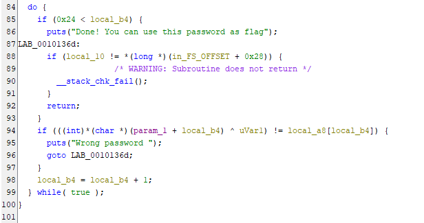
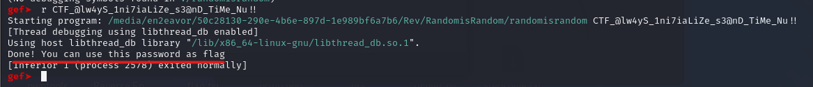

#### Categorie: Reverse
#### **Author**: 5c0r7
#### Solve: 8/20 
#### Points: 70 pts (at first)|  63 pts (at end)
#### Files: [randomisrandom](Files/randomisrandom)

#### Write-up by: [Gojo]() 

## Write-up
## Fr Vension

Un challenge sur du reverse, le titre déjà me parlais, Randmisandom, j’ai senti qu’on
aura affaire à un challenge faisant intervenir une fonction pour produire des nombres
aléatoires. Une petite lecture de la description du challenge me fait dire surement que
le random sera guessable (on peut deviner) vu qu’on nous dit que les gardiens de
trésors n’aiment pas le hasard !
Bon bon bon, Et si on mettait la main à la patte ??
Premier réflexe, une fois le fichier du challenge téléchargé, accordons-lui les
permissions nécessaire pour son exécution comme suit :

Nous pouvons donc l’exécuter :

Ah ! Son exécution nécessite un certain password, je le réexécute alors cette fois-ci
avec un mot de passe totalement fictif :

J’obtiens le message, wrong password, zut ! Je m’y entendais un peu :)
C’est du reverse, alors quoi de mieux que l’utilisation d’un outil reverse comme Ghidra
pour mieux analyser le code source !
Pour ceux qui ne savent pas, ghidra est tout simplement un outil (l’un des meilleurs)
utilisé dans le monde du reverse, il nous permet de décompiler des programmes pour
avoir un code qui se rapproche du code source d’origine de notre code programme !
On y va !
L’utilisation de ghidra est super intuitive, vous n’aurez donc pas de mal à uploader
votre binary (le fichier du challenge)
A gauche, dans le volet `Functions` , je recherche la fonction principale `main`  :

Bingo!

Voilà notre fonction main, Elle n’est pas difficile à comprendre et demande au
minimum un peu de notion en coding. Nous pouvons donc observer à la 7ieme ligne
que la fonction vérifie si au moins un argument est passé en paramètres, dans le cas
contraire il affiche le texte : **[+]Usage: ./source password**  
(Si vous vous en souvenez,c’est le même message qu’on a obtenu lors de notre premier appel du binary !).

Ensuite à la ligne `11` , une variable `sVar1`  a qui on affecte la valeur du nombre de
caractères saisi par l’utilisateur, ensuite à la ligne `12` , on check si la variable `sVar1` 
donc le nombre de caractères de l’utilisateur est égale à `0x25`  en hexadécimal, un
calcul rapide avec ma calculatrice sur mon ordinateur me donne `37`  décimal comme
sur la figure suivante :

Nous devons donc entrer notre mot de passe de telle sorte qu’il comporte `37` 
caractères ! Dans le cas contraire, on nous affiche : Wrong password comme le dit la
ligne `16` .
Un indice de trouver, on avance bien, vous ne trouvez pas ?? :)
Bof on continue la lecture du code, ensuite à la ligne `13` , si le nombre de caractères
est bon c’est-à-dire égale à `37` , la fonction `randomisrandom` est appelé !!!
Pour afficher le contenu de cette fonction, rien de plus simple, double cliquez sur son
nom !

Vous avez déjà peur ? Pas besoin, on scrolle vers le bas pour analyser notre code
A la ligne, `94` , qui retient mon intention, je remarque que si notre password ne
respecte pas certaines conditions, on nous affichera  **Wrong password !** 

Vaut mieux checker cette condition que d’analyser le code au complet !
Cette ligne récupère le premier caractère de notre password, ensuite, le convertit en
int, puis fait un `XOR`  avec la valeur de `uvar1`  pour ensuite comparer le résultat final à
l’élément situé dans le tableau `local_a8`  à la même position.
Elle fait la même chose avec le second élément de notre password qui sera comparé
au second élément de `local_a8` , ensuite la même chose pour le troisième élément et
ainsi de suite jusqu’à finir nos `37`  éléments.
Alors c’est quoi `local_b4`  ? Tout simplement un entier initialisé à `0`  à la ligne `83`  et qui
s’incrémente de `1` à la ligne `98`  à chaque tour de boucle, son principal but est de
pouvoir parcourir le tableau local_a8 et de pouvoir parcourir chaque caractère de
notre password !
Ensuite, `local_a8`, est un tableau initialisé depuis la ligne `46`  !

Ici on voit qu’il contient uniquement 4 éléments, ce qui selon moi n’est pas possible
suite a notre raisonnement, je me dis donc que **Ghidra**  a fait une petite erreur de
décompilation, parce que si vous comptez de la ligne `46` à la ligne `82` 

On remarque bien qu’on a exactement `37`  lignes, on toute simplicité, voilà notre
tableau local_a8 avec ses valeurs (Ligne `46`  à ligne `82` ) !
La seule composante dont on ignore encore le but, c’est `uvar1`  !

A la ligne `45` , on remarque bien que `uvar1`  récupère la valeur retournée par la
fonction `rand()` , un double clique sur le nom de la fonction nous laisse apercevoir
ceci :

Rien de bien intéressant, en gros, une fonction rand est appelé et puis le nombre
choisi est stocké dans `uvar1`  !
Mais est-ce que vous vous souvenez de la description du chall ??

Je doute donc que la fonction `rand()`  soit vraiment aléatoire !
Il ne reste plus qu’à vérifier quelle est sa valeur à chaque fois que nous exécutons le
code, rien de plus exaltant que l’utilisation de gdb (Il s’agit d’un désassembleur, qui
nous permet de savoir comment notre binary est gère en mémoire)
Faites des recherches pour mieux comprendre si vous êtes nouveaux dans le
domaine ! (ChatGPT est votre ami !)

Allons-y !

J'utilise une extension de gdb appelé gef, vous pouvez l’installez si nécessaire, rien de
bien compliqué !
Nous allons lancer notre programme en lui envoyant une suite de `37`  caractères
comme nous l’avons vu pour que la fonction randomisrandom soit appelé !

Entrez ce que vous voulez mais assurer vous d’avoir `37`  caractères sinon la fonction
randomisrandom ne sera pas appelé et donc pas de fonction `rand()` 

Normal ce n’est pas le bon mot de passe :)
Maintenant nous allons observer le fonctionnement de la fonction randomisrandom
dans `gdb` . Pour cela nous allons mettre un breakpoint sur cette fonction :

**b= breakpoint** 
Un breakpoint permet tout simplement d’arrêter notre programme à un endroit
précis lors de son exécution !
Entrer r pour lancer le programme

Ensuite, vous verrez

La première ligne rouge nous montre une flèche qui nous indique ou le breakpoint a
été placé, la seconde ligne indique l’adresse de l’instruction actuelle de notre fonction
et pour finir la dernière indique ce qu’il faut faire dans un langage assembleur :)
Restez avec moi notre but ne l’oubliez surtout pas, voir la valeur généré par la
fonction `rand()` . Nous allons donc nous diriger vers l’instruction qui correspond à ce
bout de code :

En gros on va tout simplement rechercher l’appel de la fonction `rand()`  dans gdb
Pour ce faire on va utiliser une commande ni (next instruction) pour aller vers
l’instruction suivante :

Bingo ! Ça marche
On remarque que l’instruction call (appel de fonction) de rand n’est pas loin, on fait
donc un ni jusqu’à l’atteindre.

Voilà, la flèche est bien à ce niveau !
N’oublier que sa valeur est mise dans la variable uvar1
On passe donc à l’instruction qui suit avec ni

On voit donc que juste après l’appel de rand, il y’a un mov (move) de la valeur
contenue dans le registre eax dans le registre `rbp-0xa8` .
En gros, si nous voulons voir ce qui est stocké dans rbp-0xa8, nous devons laisser
cette instruction s’exécuter parce que actuellement nous sommes dessus, elle ne sait
donc pas encore exécuter, eax n’a pas encore été déplacé dans rbp-0xa8. On laisse
l’instruction s’exécuter avec ni

L’instruction précédente souligné en rouge
On peut donc accéder à la valeur de `rbp-0xa8`  en faisant :

On obtient donc sa valeur : 0x6b8b4567
Pour vérifier si on obtient ce même résultat à chaque exécution du programme, je
refais ce même processus 3 ou 4 fois, à chaque fois, on obtient la même valeur !
BINGO ! On a le rand, il ne reste plus qu’à calculer ….
On a donc comme je l’avais précisé au départ :
character_of_passowrd XOR `uvar1 = local_a8[local_b4]` 
Il suffit donc de tirer le character_of_passowrd pour avoir :
`character_of_passowrd = local_a8[local_b4] XOR uvar1` 
On peut le faire manuellement pour le premier caractère qui donne :
`local_a8[0] XOR uvar1 = 0x6b8b4524 XOR 0x6b8b4567 = 67` 
Et avec python on obtient le caractère correspondant :

`Chr(67)` ` =>permet de trouver le caractère qui correspond à `67` 
N’oubliez pas qu’on retrouve les éléments du tableau de local_a8 dans le code fournit
par ghidra
Le calcul du XOR peut se faire sur des plateformes en ligne :)
Il suffit donc de continuer ainsi pour chaque caractère en faisant varier `local_b4` de `0
à 36` 
J’aurais pu le faire manuellement mais j’ai voulu essayer un script quand bien même
je ne suis pas vraiment doué en Scripting
J’ai obtenu le code suivant :

La liste contient tous les éléments de `local_a8` , j’utilise `numpy`  pour implémenter le
calcul du `XOR` 

BIIIIIIIIIINGO !

gdb nous confirme que c’est le bon password !!!!
Le flag est donc : `CTF_@lw4yS_1ni7iaLiZe_s3@nD_TiMe_Nu!!` `
Comme on peut le voir les gardiens des trésors devraient penser à aimer le hasard :)
Merci !!!!!
Flag : `CTF_@lw4yS_1ni7iaLiZe_s3@nD_TiMe_Nu!!` 