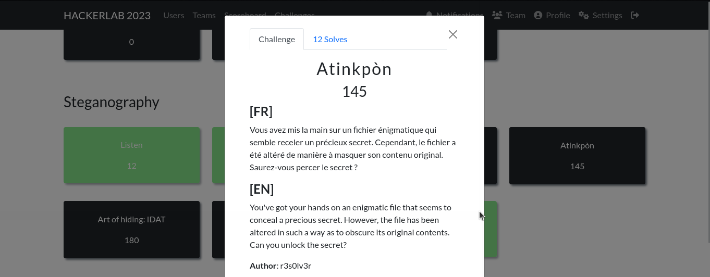
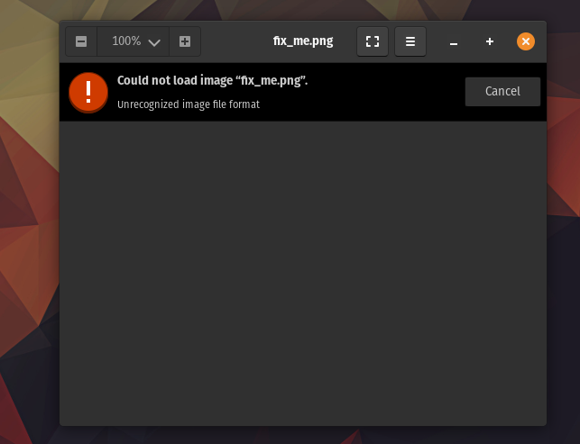
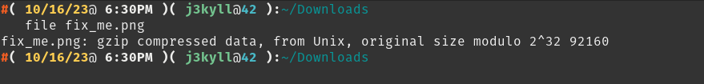
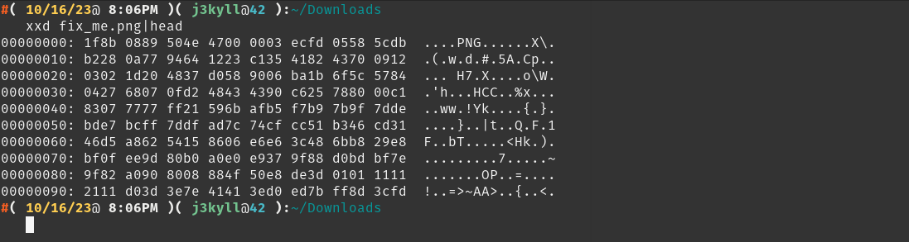
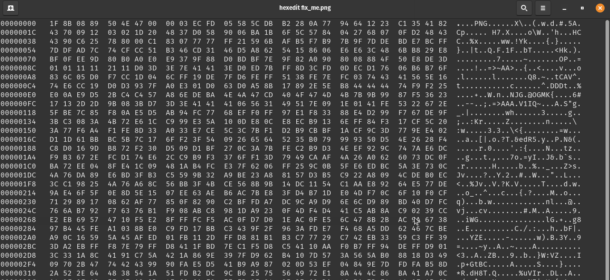
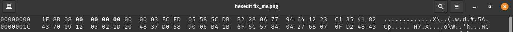
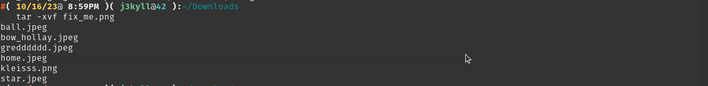
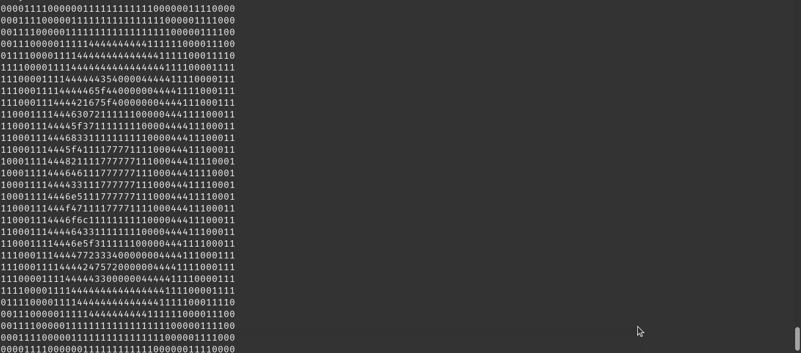
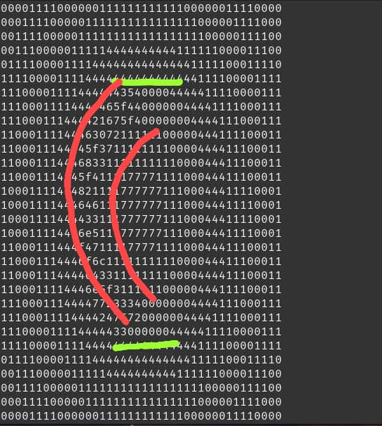

#### Categorie: Steganography
#### **Author**: r3s0lv3r
#### Solve: 12/20 
#### Points: 200 pts (at first)|  145 pts (at end)
#### Files: [fix_me.png]()   
#### Write-up by: 
### Flag Format : CTF_**[A-Za-z]**  
#### Description :
#### **[FR]**
Vous avez mis la main sur un fichier énigmatique qui semble receler un précieux secret. Cependant, le fichier a été altéré de manière à masquer son contenu original. Saurez-vous percer le secret ?
#### **[EN]**
You've got your hands on an enigmatic file that seems to conceal a precious secret. However, the file has been altered in such a way as to obscure its original contents. Can you unlock the secret?

- ###  Write-Ups
-  FR Version


Apres avoir téléchargé le fichier, on essaie de l'ouvrir, mais nous avons une erreur lors de l'ouverture.

L'erreur nous montre qu'il s'agit d'un problème de format de l'image
Nous décidons donc de vérifier quel est le véritable type du fichier vu qu'on dirait qu'il n'a pas l'air d'être une image

```bash
file fix_me.png
```



D'après ce qu'on peut constater il s'agit d'un fichier **gzip** donc il s'agit d'un fichier avec l'extension `.tar.gz'

Par réflexe, nous décidons de vérifier l'entête du fichier avec `xxd` (` hexdump`  fait aussi l'affaire)

```bash
xxd fix_me.png
```



Donc après les deux précédentes observations, nous remarquons que nous avons un fichier au format `.tar.gz` mais dont l'entête a été modifie de manière a faire croire qu'il s'agit d'un fichier au format'.png` , n'oublions pas ceci "Sous Linux, tout est fichier"

Nous devons donc corriger  l'entête du fichier en question, pour cela nous nous renseignons sur l'entête exacte d'un fichier `.tar.gz` 
Apres quelques recherches nous avons un exemple de l'entête d'un fichier `.tar.gz`

`1f8b 0800 0000 0000 0003' 

Nous voyons clairement la différence entre les deux entêtes et décidons de corriger l'entête du fichier avec `hexedit`



Après modification, nous obtenons ceci



Nous enregistrons et quittons avec "CTRL +x" 

Nous pouvons maintenant extraire le/les fichiers de l'archive avec 
```bash
tar -xvf fix_me.jpg
```


Nous remarquons que d'autres images se trouvent dans l'archive 
Examinons chacun d'eux pour voir 
Apres fouilles, nous observons une chose assez intéressante dans l'une des images obtenues. Nous avons fait un `string` sur l'image et nous avons un **Ascii  Art** plutôt bizarre.


```bash
0000111100000011111111111100000011110000
0001111000001111111111111111000001111000
0011110000011111111111111111100000111100
0011100000111114444444444111111000011100
0111100001111444444444444441111100011110
1111000011114444444444444444111100001111
1110000111144444435400004444411110000111
11100011114444465f4400000044441111000111
111000111444421675f400000004444111000111
1100011114446307211111100000444111100011
1100011144445f37111111110000444411100011
1100011144468331111111111000044411100011
110001114445f411117777111100044411100011
1000111144482111177777711100044411110001
1000111144464611177777711100044411110001
1000111144443311177777711100044411110001
100011114446e511177777711100044411110001
11000111444f4711117777111100044411100011
110001114446f6c1111111111000044411100011
1100011144446433111111110000444411100011
1100011114446e5f311111100000444111100011
1110001114444772333400000004444111000111
1110001111444424757200000044441111000111
1110000111144444330000004444411110000111
1111000011114444444444444444111100001111
0111100001111444444444444441111100011110
0011100000111114444444444111111000011100
0011110000011111111111111111100000111100
0001111000001111111111111111000001111000
0000111100000011111111111100000011110000

```   

Direction [Cyberchef](https://gchq.github.io/CyberChef/), en premier lieu, nous avons décidé de retirer tous les nombres différents de `0`et de `1' mais n'avons rien obtenu de potable.
Normalement le principe d'un ascii art, c'est d'utiliser un certain nombre de caractères (assez limite entre 2 et 5) pour représenter une image dans notre cas Les chiffres qui reviennent le plus souvent sont `0`, `1` , `4`  et `7` tout les autres chiffres sont peut être donc la clef.Mais comme on le sait tous, la plupart des challs étant du *guessing*, nous décidons de demander un Hint.
Et il se fait que nous sommes sur la bonne voie, ce qui veut dire que tous les chiffres se trouvant à l'opposé symétriquement des `0 du centre sont la clef.

 

Nous retirons alors tous les chiffres superflus et de garder ceux se trouvant dans la zone rouge, nous avons alors :
`4354465f4421675f4630725f3768335f48216464336e5f476f6c64336e5f3772333424757233`
Ces caractères sont sûrement de l'hexadécimal, nous obtenons ceci après déchiffrement

`CTF_D!g_F0r_7h3_H!dd3n_Gold3n_7r34$ur3`

Flag : `CTF_D!g_F0r_7h3_H!dd3n_Gold3n_7r34$ur3`

-------------------------------------------------------------------

  ### EN Version
  


After downloading the file, we try to open it, but we get an error when opening it.

The error shows us that there's a problem with the image format
So we decide to check what the file type really is, since it doesn't seem to be an image.

```bash
file fix_me.png
```


D'après ce qu'on peut constater il s'agit d'un fichier **gzip** donc il s'agit d'un fichier avec l'extension `.tar.gz'

Par réflexe, nous décidons de vérifier l'entête du fichier avec `xxd` (` hexdump`  fait aussi l'affaire)

```bash
xxd fix_me.png
```


Donc après les deux précédentes observations, nous remarquons que nous avons un fichier au format `.tar.gz` mais dont l'entête a été modifie de manière a faire croire qu'il s'agit d'un fichier au format'.png` , n'oublions pas ceci "Sous Linux, tout est fichier"

Nous devons donc corriger  l'entête du fichier en question, pour cela nous nous renseignons sur l'entête exacte d'un fichier `.tar.gz` 
Apres quelques recherches nous avons un exemple de l'entête d'un fichier `.tar.gz`

`1f8b 0800 0000 0000 0003' 

Nous voyons clairement la différence entre les deux entêtes et décidons de corriger l'entête du fichier avec `hexedit`


Après modification, nous obtenons ceci


Nous enregistrons et quittons avec "CTRL +x" 

Nous pouvons maintenant extraire le/les fichiers de l'archive avec 
```bash
tar -xvf fix_me.jpg
```


Nous remarquons que d'autres images se trouvent dans l'archive 
Examinons chacun d'eux pour voir 
Apres fouilles, nous observons une chose assez intéressante dans l'une des images obtenues. Nous avons fait un `string` sur l'image et nous avons un **Ascii  Art** plutôt bizarre.


```bash
0000111100000011111111111100000011110000
0001111000001111111111111111000001111000
0011110000011111111111111111100000111100
0011100000111114444444444111111000011100
0111100001111444444444444441111100011110
1111000011114444444444444444111100001111
1110000111144444435400004444411110000111
11100011114444465f4400000044441111000111
111000111444421675f400000004444111000111
1100011114446307211111100000444111100011
1100011144445f37111111110000444411100011
1100011144468331111111111000044411100011
110001114445f411117777111100044411100011
1000111144482111177777711100044411110001
1000111144464611177777711100044411110001
1000111144443311177777711100044411110001
100011114446e511177777711100044411110001
11000111444f4711117777111100044411100011
110001114446f6c1111111111000044411100011
1100011144446433111111110000444411100011
1100011114446e5f311111100000444111100011
1110001114444772333400000004444111000111
1110001111444424757200000044441111000111
1110000111144444330000004444411110000111
1111000011114444444444444444111100001111
0111100001111444444444444441111100011110
0011100000111114444444444111111000011100
0011110000011111111111111111100000111100
0001111000001111111111111111000001111000
0000111100000011111111111100000011110000

```   

Direction [Cyberchef](https://gchq.github.io/CyberChef/), en premier lieu, nous avons décidé de retirer tous les nombres différents de `0`et de `1' mais n'avons rien obtenu de potable.
Normalement le principe d'un ascii art, c'est d'utiliser un certain nombre de caractères (assez limite entre 2 et 5) pour représenter une image dans notre cas Les chiffres qui reviennent le plus souvent sont `0`, `1` , `4`  et `7` tout les autres chiffres sont peut être donc la clef.Mais comme on le sait tous, la plupart des challs étant du *guessing*, nous décidons de demander un Hint.
Et il se fait que nous sommes sur la bonne voie, ce qui veut dire que tous les chiffres se trouvant à l'opposé symétriquement des `0 du centre sont la clef.

 

Nous retirons alors tous les chiffres superflus et de garder ceux se trouvant dans la zone rouge, nous avons alors :
`4354465f4421675f4630725f3768335f48216464336e5f476f6c64336e5f3772333424757233`
Ces caractères sont sûrement de l'hexadécimal, nous obtenons ceci après déchiffrement

`CTF_D!g_F0r_7h3_H!dd3n_Gold3n_7r34$ur3`

Flag : `CTF_D!g_F0r_7h3_H!dd3n_Gold3n_7r34$ur3`