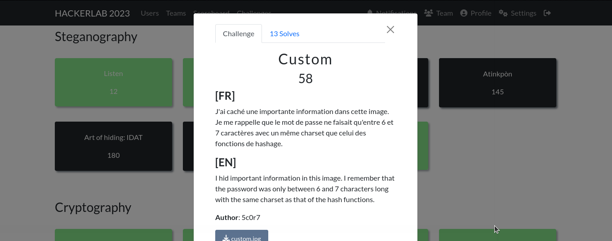

#### Categorie: Steganography
#### **Author**: 5c0r7
#### Solve: 13/20 
#### Points: 70 pts (at first)|  58 pts (at end)
#### Files: [custom.jpg](Files/custom.jpg)   
#### Write-up by: 
#### Description :
#### **[FR]**
J'ai caché une importante information dans cette image. Je me rappelle que le mot de passe ne faisait qu'entre 6 et 7 caractères avec un même charset que celui des fonctions de hashage.
#### **[EN]**
I hid important information in this image. I remember that the password was only between 6 and 7 characters long with the same charset as that of the hash functions.

## Solution :
### Fr Version : 

`For ENG version scroll down` 

