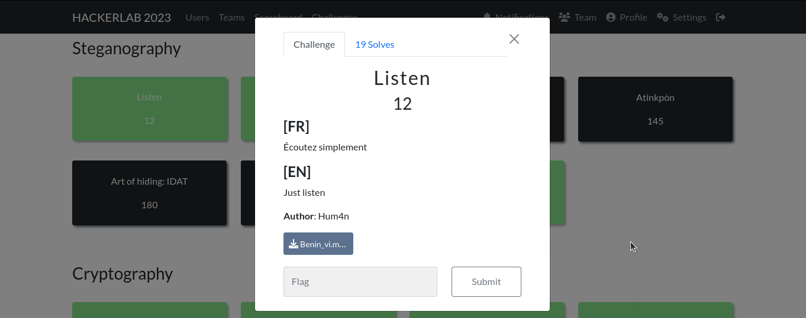

#### Categorie: Steganography
#### **Author**: Hum4n
#### Solve: 19/20 
#### Points: 30 pts (at first)|  12 pts (at end)
#### Files: [Benin_vi.mp3](Files/Benin_vi.mp3)   
#### Write-up by: 
#### Description :
#### **[FR]**
Écoutez simplement
#### **[EN]**
Just listen
**Author**: Hum4n

### Write-up
## Fr Version

Bon ce challenge est assez frustrant, pourquoi ? Parce qu'il ne demande pas de compétence particulière à part *l'écoute*.L'on a comme fichier en description un fichier audio au format MP3.
Lorsqu'on écoute l'audio on se rend compte qu'un robot ou toute autre voix non humaine en tout cas répète en continue **"Enfants du Benin debout"** .  Ce qui fait écho à l'hymne national du Benin, le plus troublant c'est que la voix répète cette phrase en continu pendant plus de 50 min.
Ne sachant pas trop quoi faire, on écoute l'audio simplement comme nous le suggère la description du challenge.
A 38:00 de l'audio nous entendons le flag`CTF_tu_ecoutes_bien_g`

Flag : `CTF_tu_ecoutes_bien_g`

------------------------------------------------------------------
### En Version

Well this challenge is quite frustrating, why? Because it does not require any particular skills other than *listening*. The file description is an audio file in MP3 format.
When we listen to the audio we realize that a robot or any other non-human voice in any case continuously repeats **"Children of Benin standing"**. What echoes the national anthem of Benin, the most disturbing thing is that the voice repeats this phrase continuously for more than 50 min.
Not really knowing what to do, we listen to the audio simply as the description of the challenge suggests.
At 38:00 of the audio we hear the flag `CTF_tu_ecoutes_bien_g`

Flag : `CTF_tu_ecoutes_bien_g` 