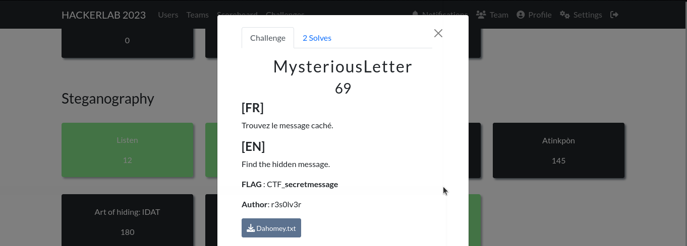
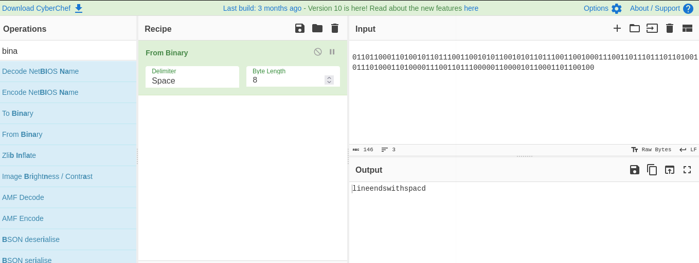

#### Categorie: Steganography 
#### **Author**: r3s0lv3r
#### Solve: 2/20 
#### Points: 70 pts (at first)| 69 pts (at end)
#### Files: [Dahomey.txt](./Files/Dahomey.txt)   
#### Write-up by: 
#### Description :
#### **[FR]**
Trouvez le message caché.
#### **[EN]**
Find the hidden message.

**FLAG** : CTF_**secretmessage**

- ### Write-Up
 - ### FR Version
 
 

Après téléchargement du fichier txt, lorsqu’on sélectionne tout le texte, on constate que certaines lignes se  terminent par un espace tandis que d’autres non. Ceci a donc attiré notre attention. Nous avons donc considérés la présence de l’espace comme 1 et son absence comme 0. Nous avons donc utilisé le script python suivant pour obtenir la suite binaire.

```python3
import re
# Ouvrir le fichier en mode lecture
fichier = open('Dahomey.txt', 'r')
# Lire chaque ligne du fichier
for ligne in fichier:
	# verifier si la ligne est vide;
	if re.findall('^\s*$', ligne):
		continue
	# verifier si la ligne se termine par un espace
	if ligne.endswith('\n'):
		print("1", end='')
	else:
		print("1", end='')
	list
	# fermer le fichier
	fichier.close()
```

En executant le script nous obtenons la suite binaire suivante:
`0110110001101001011011100110010101100101011011100110010001110011011101110110100101110100011010000111001101110000011000010110001101100100`

En la déchiffrant nous avons le string: **lineendswithspacd**


Lorsque nous soumettons le flag `CTF_lineendswithspacd`, ça ne passait pas. Nous eûmes donc l’idée de remplacer la lettre `d` par  un `e`. Nous avons donc 
CTF_**lineendswithspace** 

Flag: `CTF_lineendswithspace` 

------------------------------------------------------------------

### EN Version

 

After downloading the txt file, when we select all the text, we notice that some lines end with a space, while others do not. This caught our attention. We considered the presence of a space as 1 and its absence as 0. We then used the following python script to obtain the binary sequence.

```python3
import re
# Open the file in read mode
file = open('Dahomey.txt', 'r')
# Read each line of the file
for ligne in fichier:
	# Check if the line is empty;
	if re.findall('^\s*$', line):
		continue
	# check if the line ends with a space
	if ligne.endswith('\n'):
		print("1", end='')
	else:
		print("1", end='')
	list
	# close file
file.close()
```

Executing the script produces the following binary sequence:
`0110110001101001011011100110010101100101011011100110010001110011011101110110100101110100011010000111001101110000011000010110001101100100`

By deciphering it, we get the string: **lineendswithspacd**


When we submitted the `CTF_lineendswithspacd` flag, it didn't pass. So we came up with the idea of replacing the letter `d` with an `e`. So we have 
CTF_**lineendswithspace** 

Flag: `CTF_lineendswithspace` 