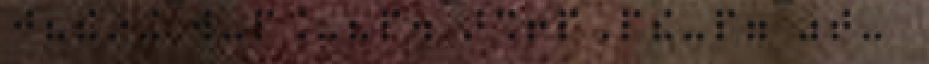
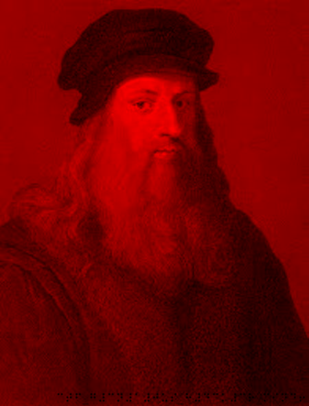

#### Categorie: Steganography 
#### **Author**: r3s0lv3r
#### Solve: 3/20 
#### Points: 200 pts (at first)| 190 pts (at end)
#### Files: [proj_.png](./Files/proj_.png)   
#### Write-up by: [Jekyll](https://twitter.com/Ted_Kouhouenou)
#### Description :
#### **[FR]**
En dehors de la boîte !
#### **[EN]**
Outside the box !

## Solution :
### Fr Version : 

`For ENG version scroll down` 


Pour commencer avec ce challenge, je peux vous dire que le contexte ne sert pas à grand-chose.
Apres plusieurs recherches et tentatives de trouver le flag, nous n'avons pas d'autre choix que de demander un **hint**.L'indice est la **résolution** , oui la résolution de l'image.
Nous augmentons donc la résolution de l'image. Nous cherchons donc un moyen de faire e genre de travail, nous trouvons donc un article de la team [bi0s](https://wiki.bi0s.in/steganography/tweak-png/) parlant d'un outil appelé 
[tweakpng](https://entropymine.com/jason/tweakpng/   .Permettant de faire le travail.

Le fichier est un  **executable** donc uniquement installable sousWindows.
Nétantt pas sous Windows je décide d'utiliser wine .
```
sudo apt install wine-stable
```
Nous demarrons avec cette commande

```bash
wine ./tweakpng.exe

```

 

Nous choisissons la première option pour modifier la résolution de l'image
Au fur et à mesure que nous élargissons l'image, nous remarquons qu'un petit message se forme en bas de l'image



Mais l'image n'est pas très claire, nous décidons donc d'uploader l'image sur [stegonline](https://stegonline.georgeom.net/) 
et d'appliquer des effets sur l'image afin de pouvoir mieux distinguer ce qui est écrit
nous appliquons l'effet rouge qui nous paraît assez net.


L'écriture affichée ne semble pas être en **ASCII**.Nous avons été assez aveugles pour ne pas reconnaître du **Braille** x).
Nous nous rendons sur [Dcode](https://www.dcode.fr/) et cherchons [l'alphabet braille](https://www.dcode.fr/alphabet-braille) 

et entrons ce qui est affiché


nous obtenons ceci `ctfforg3n10usforh4c 3rforfind!` Les caractères underscore ne s'étant pas affichés, nous tentons de les faire mettre dans la chaîne 
ctf_forg3n10us_forh4ckerfor_find!

Flag : `ctfforg3n10usforh4c 3rforfind!`

----------------------------------------------------------------------------

### Eng Version


To start with this challenge, I can tell you that context is not very useful.
After several searches and attempts to find the flag, we have no choice but to ask for a **hint**. The hint is the **resolution**, yes the resolution of the image.
So we increase the resolution of the image. So we're looking for a way to do this kind of work, so we find an article from the [bi0s](https://wiki.bi0s.in/steganography/tweak-png/) team talking about a tool called
[tweakpng](https://entropymine.com/jason/tweakpng/ .Allowing it to get the job done.

The file is an **executable** therefore only installable under Windows.
Not being on Windows I decide to use wine.
```
sudo apt install wine-stable
```
We start it with this command 

```bash
wine ./tweakpng.exe

```

 

We choose the first option to change the image resolution
As we enlarge the image, we notice that a small message forms at the bottom of the image


But the image is not very clear, so we decide to upload the image to [stegonline](https://stegonline.georgeom.net/) 
and apply effects to the image in order to better distinguish what is written
we apply the red effect which seems quite clear to us.


The writing displayed does not appear to be in **ASCII**. We were blind enough not to recognize **Braille** x).
We go to [Dcode](https://www.dcode.fr/) and search for [the braille alphabet](https://www.dcode.fr/alphabet-braille)

and enter what is displayed


we get this `ctfforg3n10usforh4c 3rforfind!` The underscore characters not being displayed, we try to put them in the string
ctf_forg3n10us_forh4ckerfor_find! 

Flag : `ctfforg3n10usforh4c 3rforfind!`
