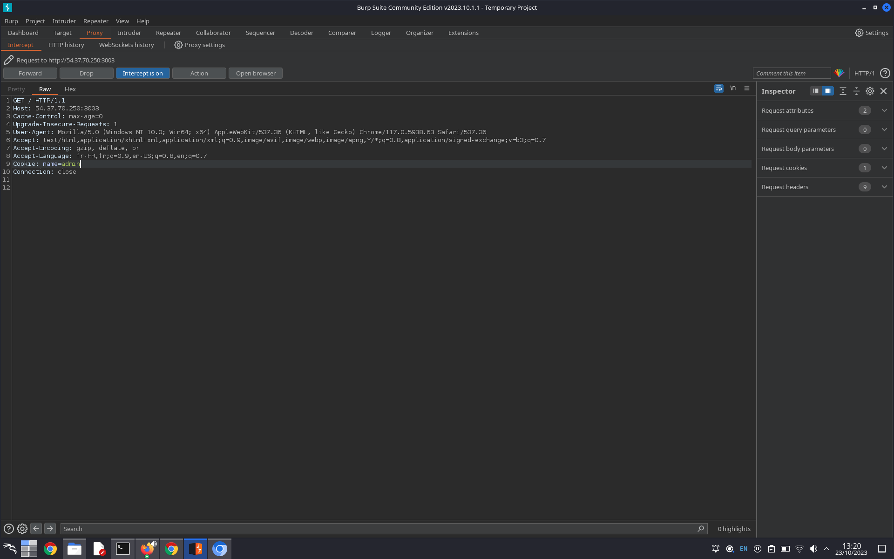
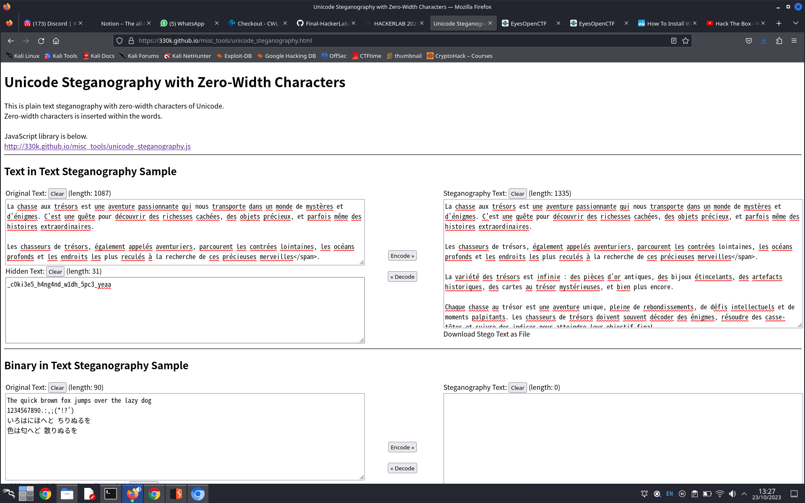

#### Categorie: Web
#### **Author**: W1z4rd
#### Solve: 11/20 
#### Points: 70 pts (at first)|  60 pts (at end)
### File : [message](./Files/message)
#### Write-up by: [Jekyll](https://twitter.com/Ted_Kouhouenou) & [Gojo](ttps://twitter.com/GOMEZJohan5)  
#### Description : 

**[FR]**
J'aime les biscuits

**[EN]**
I like cookies

[http://ctf.hackerlab.bj:3003](http://ctf.hackerlab.bj:3003) 
## Solution :
### Fr Version : 

`For ENG version scroll down` 

Premièrement, nous nous rendons sur l'adresse en utilisant le lien donné en description
[http://ctf.hackerlab.bj:3003](http://ctf.hackerlab.bj:3003) 

Le titre du challenge fait référence aux cookies , alors nous utilisons burpsuite pour intercepter ce qui se passe sur la page, nous remarquons ici que le cookie est sur `visitor`

Nous tentons de changer le cookie en le mettant sur `admin` 

Nous rafraîchissons la page pour voir s'il y a un changement

C'est bien d'avoir pu trouver quelque chose,, mais ce message a l'air de cacher quelque chose 
il nous parle de trésors caches d'aventure inoubliable , d'expériences etc 
Nous avons l'idée de vérifie si ce texte n'aurait pas un second sens et ne contiendrait pas les infos qu'on cherche, nous tentons pour cela plusieurs approche , mais celles qui s'verrais donner un résultat est l'[Unicode steganographie](https://330k.github.io/misc_tools/unicode_steganography.html ) 

et ainsi nous voyons `_c0ki3e5_h4ng4nd_w1dh_5pc3_yeaa`

Flag : `CTF_c0ki3e5_h4ng4nd_w1dh_5pc3_yeaa`

---------------------------------------------------------------------------

### Eng Version 

First we go to the address using the link given in description
[http://ctf.hackerlab.bj:3003](http://ctf.hackerlab.bj:3003) 

The title of the challenge refers to cookies, so we use burpsuite to intercept what is happening on the page, we notice here that the cookie is on `visitor`

We attempt to change the cookie by setting it to `admin` 

We refresh the page to see if there is a change 

It's good to have been able to find something, but this message seems to be hiding something
he tells us about hidden treasures of unforgettable adventure, experiences etc.
We have the idea of checking if this text would not have a second meaning and would not contain the information we are looking for, we are trying several approaches for this, but the one which would give a result is the [Unicode steganography ](https://330k.github.io/misc_tools/unicode_steganography.html)

and so we see `_c0ki3e5_h4ng4nd_w1dh_5pc3_yeaa`

Flag : `CTF_c0ki3e5_h4ng4nd_w1dh_5pc3_yeaa`

